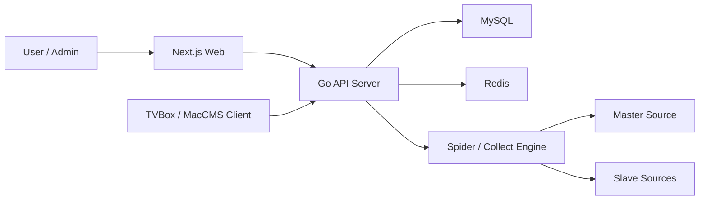
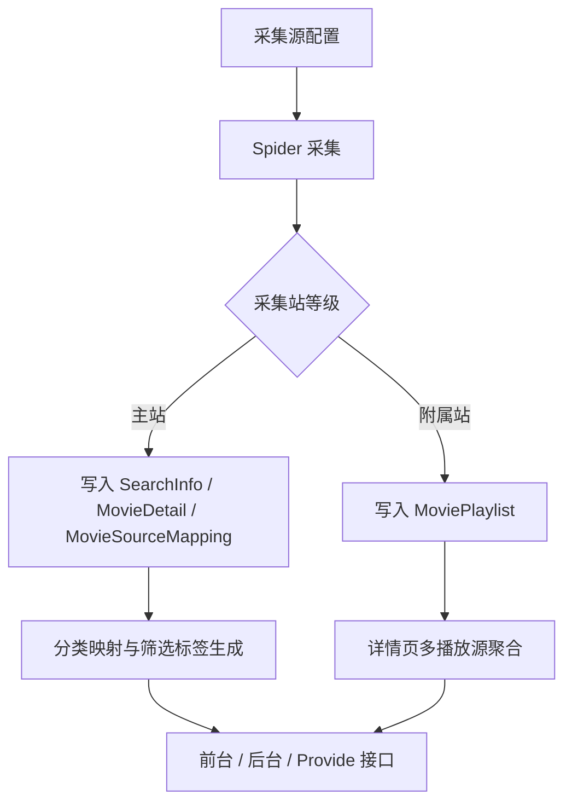
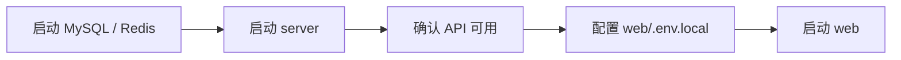
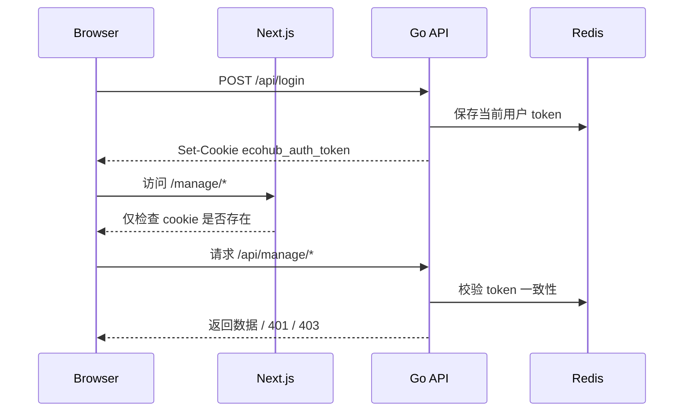

# EcoHub

EcoHub 是一个前后端分离的影视聚合系统：

- `server/`：Go API 服务，负责采集、聚合、缓存、鉴权和对外接口
- `web/`：Next.js 前端，包含前台站点、登录页和管理后台

当前代码的核心逻辑不是“多个资源站平铺入库”，而是“单主站 + 多附属站”：

- 主站负责影片主数据，写入 `SearchInfo`、`MovieDetail` 和来源映射
- 附属站只补充播放列表，写入 `MoviePlaylist`
- 内容归并优先使用豆瓣 ID，没有豆瓣 ID 时回退到片名哈希
- 分类优先走源站分类映射，失败时再回退到名称推断

> 项目仅用于学习和技术交流，不提供影视资源存储。

## 演示站

- 演示地址：[https://eco.fe-spark.cn/](https://eco.fe-spark.cn/)
- TVBox / 影视仓接入地址：`https://eco.fe-spark.cn/api/provide/config`
- EcoHub App 接入地址：`https://eco.fe-spark.cn/api`
- 演示站后台体验需要使用访客账号登录：账号 `guest`，密码 `guest`

## 系统总览



## 核心数据流



## 仓库结构

```text
.
├── server/              # Go 服务端
├── web/                 # Next.js 前端
├── docker-compose.yml   # Web + API 容器编排
├── README-Docker.md     # Docker 部署说明
├── README-FAQ.md        # FAQ 与排障说明
├── server/README.md     # 服务端说明
└── web/README.md        # 前端说明
```

## 技术栈

### Server

- Go 1.24
- Gin
- GORM
- MySQL 8
- Redis 7
- robfig/cron

### Web

- Next.js 16.1.6
- React 19.2.3
- Ant Design 6
- TypeScript
- Axios
- Artplayer / Hls.js

## 当前实现重点

- 单主站机制：任意时刻仅允许一个主站，主站切换会触发主数据清理与重新归档
- 播放源聚合：详情页会按豆瓣 ID 和标题候选哈希，从附属站回捞可用播放列表
- 分类归一：先用 `CategoryMapping` 做源站分类映射，再按名称语义兜底
- 缓存策略：首页、筛选配置、TVBox 列表都走 Redis，并在影片写入后主动失效
- 开放接口：`/api/provide/vod` 兼容 MacCMS 查询模式，`/api/provide/config` 输出 TVBox/影视仓配置

## 本地开发

### 1. 启动后端

在 `server/.env` 中配置这些变量：

- `PORT` 或 `LISTENER_PORT`
- `JWT_SECRET`
- `MYSQL_HOST`
- `MYSQL_PORT`
- `MYSQL_USER`
- `MYSQL_PASSWORD`
- `MYSQL_DBNAME`
- `REDIS_HOST`
- `REDIS_PORT`
- `REDIS_PASSWORD`
- `REDIS_DB`

启动：

```bash
cd server
./run-local.sh
```

`./run-local.sh` 适用于已安装 Bash 和 Go 的 macOS、Linux、WSL、Git Bash 等环境。
Windows 原生 `cmd` / PowerShell 不适用这个脚本；这类环境请改用 Docker，或先自行注入 `.env` 中的环境变量后再执行 `go run ./cmd/server`。

服务监听地址由 `PORT` 或 `LISTENER_PORT` 决定。
如果同时配置了 `PORT` 和 `LISTENER_PORT`，当前实现会优先使用 `PORT`。

> `ENV=dev` 或 `IS_DEV_MODE=true` 会开启开发模式。该模式下服务启动时会清空 Redis，并重置 MySQL：有权限时删库重建，没有删库权限时退化为清空现有表。

### 2. 启动前端

在 `web/.env.local` 中配置：

```env
API_URL=http://your-api-origin
```

`API_URL` 必填，且必须指向后端服务入口。当前实现下：

- 运行 `next dev` 时如果缺失会直接报错
- 运行 `next build` 时如果缺失也会直接报错
- SSR 请求同样依赖它

启动：

```bash
cd web
npm install
npm run dev
```

前台入口跟随 Next 开发服务地址，后台固定在 `/manage`，登录页固定在 `/login`。

### 3. 启动顺序



### 4. 内置账号

服务启动时会自动补齐内置账号：

| 类型 | 账号 | 密码 | 权限 |
| --- | --- | --- | --- |
| 管理员 | `admin` | `admin` | 可读可写 |
| 访客 | `guest` | `guest` | 只读 |

演示站后台请使用访客账号登录：账号 `guest`，密码 `guest`。

部署后应立即修改默认口令，或直接替换为你自己的账号体系。

## Docker 部署

项目自带 `docker-compose.yml`，会启动：

- `web`：Next.js 前端
- `server`：Go API 服务

当前 Compose 不包含 MySQL 和 Redis 容器，需要你自行准备外部实例。

快速开始：

```bash
cp .env.example .env
docker compose up --build -d
```

对外访问入口以你的 Compose 端口映射或反向代理配置为准，后台路径仍然是 `/manage`。

当前 Compose 的关键行为：

- `server` 服务读取根目录 `.env`
- `web` 在镜像构建阶段写入 `API_URL`，供 rewrites 和 SSR 共用
- 如果你修改了服务名、网络结构或 API 对内地址，需要同步调整 `docker-compose.yml` 和 `web/Dockerfile`

更多内容见 [README-Docker.md](./README-Docker.md)。

## 鉴权说明

- 登录成功后，后端会下发 `HttpOnly` cookie：`ecohub_auth_token`
- 前端 `src/proxy.ts` 仅在访问 `/manage` 时检查 cookie 是否存在
- 真正的鉴权边界在后端：`/api/manage/*` 和 `/api/logout` 都会校验 JWT 与 Redis 中的当前有效 token
- 访客账号可以读取后台数据，但所有写操作都会被后端 `WriteAccess` 中间件拒绝
- JWT 过期但 Redis 中仍保留当前 token 时，后端会自动刷新 cookie



## 文档导航

- [服务端说明](./server/README.md)
- [前端说明](./web/README.md)
- [Docker 部署说明](./README-Docker.md)
- [FAQ 与排障](./README-FAQ.md)

## 许可证

项目使用 [MIT License](./LICENSE)。
