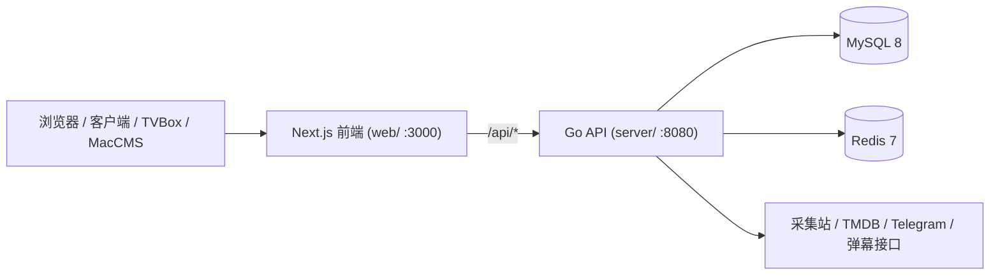

<div align="center">


# EcoHub

[](https://github.com/fe-spark/EcoHub/releases)
[](https://go.dev/)
[](https://nextjs.org/)
[](https://www.mysql.com/)
[](https://redis.io/)
[](https://github.com/fe-spark/EcoHub/pkgs/container/ecohub)
[](./LICENSE)

**自托管影视聚合系统：从采集站汇集影视数据，提供观影网站、管理后台与多端订阅接口。**

中文 | [English](./docs/README_EN.md)

[在线演示](https://eco.fe-spark.cn) · [管理后台演示](https://eco.fe-spark.cn/manage) · [部署指南](./docs/README-Deploy.md) · [常见问题](./docs/README-FAQ.md) · [版本说明](./docs/RELEASE.md) · [交流群组](https://t.me/ecohub_club)

</div>

> [!WARNING]
> v3 与 v2 的数据库不兼容，且不提供数据迁移。请勿在旧的 `./data/mysql` 上直接拉取新镜像，也勿使用 v2 后台的「立即升级」。升级步骤见 [从 v2 升级到 v3](./docs/v2-to-v3.md)。

## 简介

EcoHub 是一套面向个人与小型团队的自托管影视聚合系统。管理员在后台配置采集站后，系统定时拉取影片数据并统一入库，提供观影网站、管理后台及客户端订阅接口。

系统以单个 All-in-One Docker 镜像发布，配合 MySQL 8 和 Redis 7 即可运行。

EcoHub 不提供、不存储任何影视文件，片源全部来自部署者自行配置的采集接口。

## 主要功能

- **多站采集与调度**：支持 JSON / XML 采集接口、全量/增量采集、失败重试与采集批次记录；内置每小时增量采集及片库、日志、采集记录清理任务。
- **主站与内存检索**：后台显式指定全局主站（调整排序不改变主站），内存倒排索引常驻当前主站并支持分词、全拼与简拼检索；支持分类规则配置与 TMDB 元数据刮削。
- **观影网站与播放器**：提供首页轮播、分类筛选、每日更新、观看历史与私有化访问控制；集成 Artplayer 与 Hls.js 播放器，支持多线路切换、进度记忆与全网弹幕。
- **多端订阅接口**：提供 `/api/provide/app`（EcoHub 客户端）、`/api/provide/tvbox`（TVBox / 影视仓）与 `/api/provide/vod`（MacCMS）订阅地址，播放页按匹配键聚合其他启用站点的线路。
- **管理后台与运维**：覆盖采集中心、片库与轮播管理、素材中心、数据分析、多角色账号、分模块网络代理、Telegram 通知、配置导出导入及在线升级。
- **独立客户端**：以 git submodule 形式关联 [EcoHub for Android](https://github.com/fe-spark/EcoHub-for-Android)（`app-for-android/`）与 [EcoHub for OHOS](https://github.com/fe-spark/EcoHub-for-OHOS)（`app-for-ohos/`）。

功能细节与机制说明见 [常见问题](./docs/README-FAQ.md)。

## 技术架构

| 组件 | 技术栈 | 目录 |
| --- | --- | --- |
| 后端 API | Go 1.27、Gin、GORM | `server/` |
| 前端 | Next.js 16、React 19、TypeScript、Ant Design 6 | `web/` |
| 数据库与缓存 | MySQL 8、Redis 7 | — |
| 发布镜像 | `ghcr.io/fe-spark/ecohub`（`linux/amd64`、`linux/arm64`） | `Dockerfile`、`deploy/release/` |


```mermaid
flowchart LR
    Browser["浏览器 / 客户端 / TVBox / MacCMS"] --> Web["Next.js 前端 (web/ :3000)"]
    Web -- "/api/*" --> API["Go API (server/ :8080)"]
    API --> MySQL[("MySQL 8")]
    API --> Redis[("Redis 7")]
    API --> External["采集站 / TMDB / Telegram / 弹幕接口"]
```

## 快速开始

环境要求：Docker 20+ 与 Docker Compose，建议 2 核 CPU、2 GB 内存及以上。执行以下命令安装：

```bash
curl -fsSL https://raw.githubusercontent.com/fe-spark/EcoHub/main/scripts/install-release.sh \
  | ECOHUB_IMAGE=ghcr.io/fe-spark/ecohub:v3.1.0 sh
```

安装完成后终端将输出前台/后台地址、初始账号与订阅地址，默认 Web 端口为 `3000`，数据目录为 `~/ecohub`，后续可通过 `ecohub` 命令管理。自定义密码、端口、1Panel、手动部署、反向代理与环境变量见 [部署指南](./docs/README-Deploy.md)。

## 推荐

| 类型 | 服务商 | 链接 |
| --- | --- | --- |
| 服务器 | CloudCone（演示站所用，磁盘 I/O 不限） | [选购](https://app.cloudcone.com/?ref=14393) |
| 网络 | 良心云，低至 2 元/月 | [注册](https://xn--9kqz23b19z.com/#/register?code=xAmvfdic) |
| 网络 | 赔钱机场，低至 1.5 元/月 | [注册](https://xn--mes358aby2apfg.com/register?code=FA4xlzHD&cover=sfw) |
| 网络 | DOVE | [注册](https://dovee.cc/a.php?asbcbO1PCgTx2JM66) |

## 文档

| 文档 | 内容 |
| --- | --- |
| [部署指南](./docs/README-Deploy.md) | 安装、`ecohub` 命令、密码、端口、1Panel、反向代理、环境变量 |
| [从 v2 升级到 v3](./docs/v2-to-v3.md) | 删除旧容器、使用空库重装、全量采集 |
| [常见问题](./docs/README-FAQ.md) | 空站、主站、采集、缓存、网络代理、弹幕、登录、私有化访问 |
| [计划任务运行冲突](./docs/cron-task-conflict.md) | 采集任务与维护任务同时触发时的执行顺序 |
| [开发指南](./docs/README-Dev.md) | 本地开发环境与开发编排 |
| [服务端说明](./server/README.md) | Go 后端启动、环境变量、接口、目录结构 |
| [前端说明](./web/README.md) | Next.js 前端启动、`API_URL`、鉴权、目录结构 |
| [版本说明](./docs/RELEASE.md) | 当前版本及历史版本的变更内容 |
| [文档索引](./docs/README.md) | 全部中英文文档索引 |

## 目录结构

```text
EcoHub/
├── server/              # Go 后端 API
├── web/                 # Next.js 前端（前台与管理后台）
├── app-for-android/     # Android 客户端（git submodule）
├── app-for-ohos/        # OHOS 客户端（git submodule）
├── deploy/release/      # 发布编排 compose.yml
├── scripts/             # 安装脚本 install-release.sh（ecohub 命令）
├── docs/                # 项目文档
├── .github/workflows/   # GitHub Release 与 Docker 镜像构建流程
├── Dockerfile           # All-in-One 发布镜像
├── docker-compose.yml   # 本地开发编排
└── supervisord.conf     # 镜像内进程管理配置
```

## 参与贡献

本项目由作者业余维护，更新频率有限，欢迎提交 [Issues](https://github.com/fe-spark/EcoHub/issues) 与 [Pull Requests](https://github.com/fe-spark/EcoHub/pulls)。文档修改请遵循 [文档写作规范](./docs/STYLE.md)。

### 本地开发

环境要求：Go 1.27+、Node.js 20.9+、MySQL 8、Redis 7。搭建步骤与编排说明见 [开发指南](./docs/README-Dev.md)，模块细节见 [服务端说明](./server/README.md) 与 [前端说明](./web/README.md)。

## 许可证

本项目基于 [PolyForm Noncommercial License 1.0.0](./LICENSE) 发布，仅允许非商业用途。

使用 EcoHub 时请遵守当地法律法规及采集站的使用条款。
