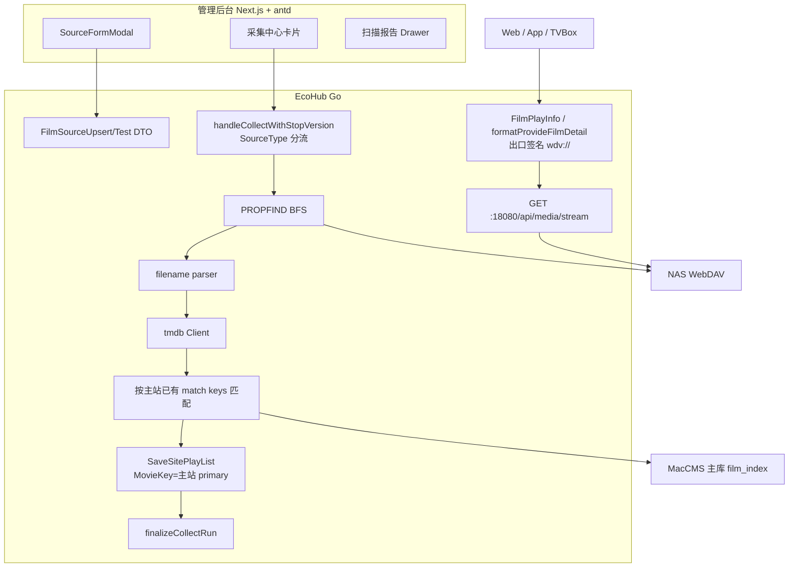
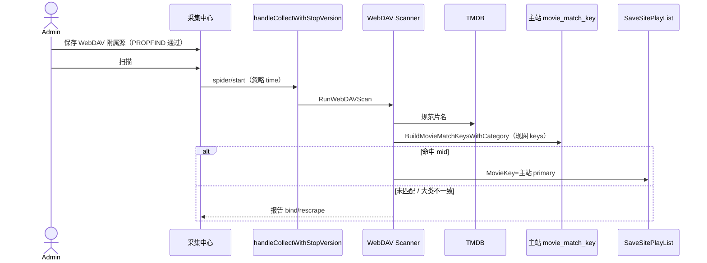
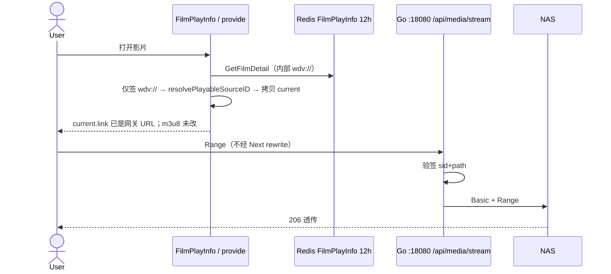

# EcoHub WebDAV + TMDB 媒体库接入方案（可落地修订版）

| 项 | 内容 |
| :--- | :--- |
| 文档标题 | EcoHub WebDAV + TMDB 媒体库接入 |
| 作者 | EcoHub 工程（设计修订） |
| 日期 | 2026-09-15 |
| 状态 | Draft（评审通过；用户已确认本期范围） |
| 范围 | **本期仅附属 WebDAV + 已有苹果 CMS 主站**；管理后台扩展现有采集页；前台/App/TVBox 零新页面 |
| 前序 | 原稿过简；R1–R3 闭环；R4 分流点改到 activeTasks.Store 之后、relPath 禁止前导 /、provide 必须绝对 streamBase |

> **UI 规范声明（避免误读 `.ai/ui-rules.md`）**  
> 仓库根目录 `.ai/ui-rules.md` 写的是 **鸿蒙 App ArkUI** 规范，**不适用于本方案的管理端**。  
> - **管理后台**：Next.js + Ant Design，扩展 `web/src/app/manage/collect/`。  
> - **鸿蒙 / 安卓 / 前台 Web / TVBox**：不新增页面，只消费现有详情/播放 API 与播放器。

> **本期范围（用户已确认，锁定附属站方案）**  
> 只做 **附属高清线**：必须已有苹果 CMS 主站。WebDAV 源 `Grade` 强制 `SlaveCollect`，只写 `slave_movie_playlists`，扫描后把 NAS 文件挂到同名影片的播放线路。  
> **不做**：独立建库、每个 WebDAV 算新大类、单独 WebDAV 菜单页、把 WebDAV 当系统唯一主站 / 升主 / 写 `film_index`。这些列为 **后续**，不在本期 PR。  
> 升主相关代码路径（`SyncMasterCategoryTree`、`CollectCategory`、`ensureMasterCategoriesReady`）本期 **禁止 WebDAV 走进去**（保存时拒绝 `grade=0`）。

---

## Overview

EcoHub 当前只认 MacCMS 采集站：`FilmSource` 无源类型，新增/测试/采集一律走 `spider.CollectApiTest`（`ac=list&pg=1`）。私有 NAS / Alist WebDAV 上的 MP4/MKV 无法进入播放列表。

本期在不引入 FFmpeg、VFS、独立媒体库前台、重型 WebDAV SDK 的前提下：

1. 采集中心增加 WebDAV 源类型；测试用 `PROPFIND`；动作为「扫描」而非分页采集。  
2. 扫描：列举视频 → 文件名解析 → TMDB 刮削得到规范片名 → **按现网匹配键**挂到已有主站影片 → `SaveSitePlayList`。  
3. 播放链接存内部 `wdv://`；**仅在 HTTP 响应出口签名**，不进 `GetFilmDetail` 的 12h Redis 缓存。  
4. 流网关由 **Go 直出**（禁止经 Next.js rewrite 拉媒体字节）；HMAC 防路径枚举，**无 exp**（与 TVBox 缓存 `vod_play_url` 兼容）。  
5. 增量指纹跳过 TMDB；NAS 文件消失则下线该源线路；未匹配/误判电影可在报告里 **绑定为剧并合并**。

---

## Background & Motivation

### 现状（代码事实）

| 能力 | 现状 | 关键路径 |
| :--- | :--- | :--- |
| 采集源模型 | 仅 MacCMS 字段，无 `SourceType` / `WebdavConfig` | `server/internal/model/spider.go` `FilmSource` |
| URI 唯一 | `uri` uniqueIndex size 255；`Id = utils.GenerateHashKey(Uri)`（会剥 `|.:/` 再 FNV32） | `FilmSource.Uri`；`CollectService.SaveFilmSource` |
| 主站唯一 | 全局一个 `MasterCollect`；升主会 `ClearMasterDataBySourceIDsFast` 且 **必须** `SyncMasterCategoryTree` 成功 | `collect_service.go` `SaveFilmSource` / `updateFilmSource` |
| 分类同步 | `CollectCategory` → `GetCategoryTree(Uri)` 当 MacCMS 接口；空树时 `ensureMasterCategoriesReady` 再拉一次 | `spider/collect_category.go` |
| 连通测试 | 固定 `ac=list&pg=1` + JSON | `spider.CollectApiTest` |
| 采集执行栈 | `StarSpider` → `StartCollect`/`BatchCollect`/`AutoCollectTriggered` → **`handleCollectWithStopVersion`** → MacCMS 分页 | `spider/Spider.go:212`；`spider_handler.go` 且 `time==0` 直接失败 |
| 进度 | 内存 `CollectProgress`（页语义） | `collect_progress.go`；`GetFilmSourceList` |
| 主站入库 | Mid = `detail.Id`；`ContentKey = vod_{id}` | `write_repo.go`；`entity_helper.go` `BuildContentKey` |
| 附属入库 | `SaveSitePlayList`；`MovieKey = BuildPlaylistPrimaryMovieKey` = **keys[0]** | `playlist_repo.go`；`playlist_helper.go` |
| 播放聚合 | `multipleSource` 用 **主站已写入** 的 match keys 去查 `slave_movie_playlists.movie_key` | `index_service.go`；`LoadMovieMatchKeys*` |
| 大类不一致 | `loadMatchedSearchInfosByDetails`：`detailPid != infoPid` 则 skip | `playlist_repo.go` ~219–226 |
| 年份索引 | `FilmIndex.Year` 来自 `ReleaseDate` 四位年，不是 `descriptor.Year` | `normalizeSearchMetadata` |
| 详情缓存 | `GetFilmDetail` Redis TTL **12h+jitter**；rewrite 在 singleflight **内**；`len(rules)==0` 时 `rewriteURLGroup` 原样返回 | `index_service.go` ~575–654、967 |
| 播放入口 | `FilmPlayInfo` 调 `GetFilmDetail` 后再 `resolvePlayableSourceID`（无偏好则第一条有片源） | `index_handler.go` |
| TVBox | `formatProvideFilmDetail` 拼 `vod_play_url`；`?source=` 走 `GetVodDirectBySource(s.Uri)` | `provide_service.go`；`provide_handler.go` 96–104 |
| 删源 | `DelCollectResource` 只删 cron rel / slave playlist / poster / failure / film_sources | `spider_repo.go:333` |
| 删影片 | `DelFilmSearch` 不碰尚未存在的 webdav 表 | `admin_repo.go:40` |
| 备份 | `ConfigBackup.FilmSources []FilmSource`；注释写不含账号密码 | `model/backup.go` |
| CORS | `Expose-Headers` 无 `Content-Range` / `Accept-Ranges` | `middleware/Cors.go:22` |
| HTTP 客户端 | 采集侧 `InsecureSkipVerify: true`，超时 20s | `utils/Request.go` |
| 部署 | 浏览器打 web:3000，`next.config.ts` `/api/:path*` rewrite 到 Go；`SERVER_PORT` 默认 18080 直出 Go | `web/next.config.ts`；`docker-compose.yml` |
| 前台播放器 | ArtPlayer；错误 overlay + 播放页 `message.error` 可能叠两句 | `VideoPlayer/index.tsx`；`play/view/index.tsx` |
| 分类常量 | `电影/电视剧/综艺/动漫/纪录片/短剧/其他` | `model/constants.go` |
| 源上限 | 前后端 12 | `MaxCollectSources` / `MAX_COLLECT_SOURCES` |

### 痛点

- 私有高清进不了现有片库。  
- 现有新增采集站会对 WebDAV 跑 MacCMS 测试。  
- 若把 TMDB 键当成 playlist 主键，入库看似成功，`multipleSource` 按主站 keys 聚合时 **找不到线路**。  
- 原稿流网关未验签、无超时、302 带 Basic Auth。

---

## Goals & Non-Goals

### Goals（本期）

1. WebDAV 作为 `FilmSource.SourceType`，**仅附属站**，与 MacCMS 主站并存；不新开菜单、不做第二套前台。  
2. 闭环：配置 → PROPFIND 测试 → 扫描 → 解析 → TMDB → 按**现网 MovieKey 规则**入库 → 快照收尾 → 网关 Seek → 增量/删除/报告绑定合并 → 可观测。  
3. 管理后台 UI 可画可做。  
4. 所有端播放 URL 都是 EcoHub 网关地址，**不含 WebDAV 密码**。  
5. 容量：单源 **≤ 5000 个视频文件**（约 200 部 × 25 集即触顶，剧集库请拆 RootPath）；TMDB ≤ 4 QPS；局域网直连 Go 时首字节 < 1s；Range 206。

### Non-Goals（本期）

- WebDAV 升主 / 写 `film_index` / 从 WebDAV 拉分类树（后续）。  
- 改 `BuildPlaylistPrimaryMovieKey` 的 keys[0] 顺序；禁止把 `tmdb_*` 当 playlist 主键。  
- FFmpeg / 转码 / VFS / fsnotify / 重型 WebDAV SDK / NFO。  
- DirectStream / Alist `/d/` 302（本期只代理透传）。  
- `MediaType=auto`（本期强制按源选电影或剧集，避免一季拆成多部电影）。  
- 远程海报反代；密码 KMS。  
- 独立媒体库页、单独 WebDAV 菜单、每个 WebDAV 源单独建分类树、ArkUI 管理端。

---

## Proposed Design

### 1. 总体架构



### 2. 数据源模型

不新建采集源表。`FilmSource` 增列（AutoMigrate）：

```go
type SourceType string
const (
    SourceTypeMacCMS SourceType = "maccms" // 缺省
    SourceTypeWebDAV SourceType = "webdav"
)

type FilmSource struct {
    // 现有字段保留
    SourceType   SourceType `json:"sourceType" gorm:"size:32;default:maccms"`
    WebdavConfig string     `json:"webdavConfig" gorm:"type:text"` // 库内 JSON；备份走此 tag
}

type WebdavConfig struct {
    ServerURL       string `json:"serverUrl"`
    Username        string `json:"username"`
    Password        string `json:"password"`
    RootPath        string `json:"rootPath"`
    MediaType       string `json:"mediaType"` // 本期仅 "movie" | "tv"
    TmdbApiKey      string `json:"tmdbApiKey"`
    TmdbBaseURL     string `json:"tmdbBaseUrl"`
    ScanIntervalMin int    `json:"scanIntervalMin"`
    MinFileBytes    int64  `json:"minFileBytes"`
    PlayFromName    string `json:"playFromName"`
}
```

**不要**给 `WebdavConfig` 列加 `json:"-"`：`ConfigBackup.FilmSources []FilmSource` 依赖同一结构，`json:"-"` 会导致导出缺配置、导入残源。脱敏只发生在 **管理 API 投影 DTO**。配置备份会包含 WebDAV 密码（站点登录账号仍不含）；导出提示「备份含 NAS 密码，请妥善保管」。

**请求/响应 DTO（禁止再 `ShouldBindJSON(&model.FilmSource)` 接 WebDAV 嵌套对象）：**

```go
// handler 或 model/dto
type FilmSourceUpsertRequest struct {
    Id                 string            `json:"id"`
    Name               string            `json:"name"`
    Uri                string            `json:"uri"` // MacCMS 用；WebDAV 忽略，由服务端合成
    Grade              model.SourceGrade `json:"grade"`
    State              bool              `json:"state"`
    IsPosterSource     bool              `json:"isPosterSource"`
    Interval           int               `json:"interval"`
    Cd                 int               `json:"cd"`
    DomainReplaceRules string            `json:"domainReplaceRules"`
    SourceType         model.SourceType  `json:"sourceType"`
    Webdav             *WebdavUpsert     `json:"webdav"`
}

type WebdavUpsert struct {
    ServerURL       string `json:"serverUrl"`
    Username        string `json:"username"`
    Password        string `json:"password"` // 空 = 不修改
    RootPath        string `json:"rootPath"`
    MediaType       string `json:"mediaType"`
    TmdbApiKey      string `json:"tmdbApiKey"` // 空 = 不修改（编辑）
    TmdbBaseURL     string `json:"tmdbBaseUrl"`
    ScanIntervalMin int    `json:"scanIntervalMin"`
    MinFileBytes    int64  `json:"minFileBytes"`
    PlayFromName    string `json:"playFromName"`
}

type FilmSourceTestRequest struct {
    Id         string           `json:"id"` // 列表「测试连通」只传 id，服务端读库
    SourceType model.SourceType `json:"sourceType"`
    Name       string           `json:"name"`
    Uri        string           `json:"uri"`
    Webdav     *WebdavUpsert    `json:"webdav"`
}

type FilmSourcePublic struct {
    // 展开 FilmSource 的公开字段，不含 webdavConfig 原文
    Id, Name, Uri string
    Grade model.SourceGrade
    State, IsPosterSource bool
    Interval, Cd int
    DomainReplaceRules string
    SourceType model.SourceType `json:"sourceType"`
    LastCollectTime *time.Time `json:"lastCollectTime,omitempty"`
    Progress *model.CollectProgress `json:"progress,omitempty"`
    Webdav *WebdavConfigPublic `json:"webdav,omitempty"`
    ScanSummary *WebdavScanSummary `json:"scanSummary,omitempty"` // 最新报告摘要；无报告为 null
}

type WebdavConfigPublic struct {
    ServerURL, Username, RootPath, MediaType, TmdbBaseURL, PlayFromName string
    PasswordSet, TmdbApiKeySet bool
    ScanIntervalMin int
    MinFileBytes int64
}
```

Handler：`add/update` bind `FilmSourceUpsertRequest` → 合成 URI、合并空密码、本期若 `sourceType=webdav && grade==Master` 返回「本期不支持将 WebDAV 设为主站」→ `ValidURL(serverUrl)` → 测试/保存。  
`test` bind `FilmSourceTestRequest`：有 `id` 则读库（不跑 `ValidURL(合成Uri)`）；无 id 则用草稿 `webdav`。

**合成 Uri**（uniqueIndex + 区分同 NAS 不同根）：

1. `url.Parse(ServerURL)`，小写 host、去默认端口、path 去尾 `/`。  
2. `RootPath` 保证以 `/` 开头、无尾 `/`（根就是 `/`）。  
3. `fmt.Sprintf("webdav|%s|%s", normalizedServer, rootPath)`。  
4. 总长 >255 则保存失败。  
5. `Id = GenerateHashKey(Uri)` 仍会剥标点；规范化可降低同 NAS 不同写法撞 id。

卡片展示 `ServerURL`，不要把合成 URI 当 `href`。

本期：`grade` 对 WebDAV **写入时强制 SlaveCollect**。前端主库选项 disabled。

占用同一 `MaxCollectSources=12`，表单提示「含 WebDAV，最多 12 个源」。

### 3. 身份键：本期不写 FilmIndex；playlist 主键必须是主站已有键

本期附属站 **不调用** `SaveDetails` / `BuildContentKey` / `ConvertFilmIndex`。不分配 WebDAV Mid。

| 键 | 规则 | 用途 |
| :--- | :--- | :--- |
| 文件身份 | `sourceId + sha1(relPath)` | `webdav_scan_item` 唯一；path 正文放 `text` |
| GroupKey | 电影 `movie:{sha1(relPath)}`；剧 `tv:{sha1(normTitle\|season)}`（无季则 1） | 多文件合成一条 playlist；同 Mid 自动合并多季 |
| 匹配查找键 | 现网 `BuildMovieMatchKeysWithCategory` + 剧集季候选名（如「片名 第N季」） | 用片名哈希 / `#cat_{pid}` 去 `movie_match_key` 找 mid |
| **playlist.MovieKey** | 命中 mid 后，用 **该主站影片** 的 `BuildPlaylistPrimaryMovieKey`（keys[0]：豆瓣哈希或 `hash(片名#cat_pid)` 或纯片名哈希） | `slave_movie_playlists.movie_key`。**禁止** `tmdb_*`、**禁止** year 键 |
| 内部播放链 | `wdv://{sourceId}/{base64.RawURLEncoding(relPath)}` | 写入 playlist JSON / Redis 缓存 |

**为什么不能把 tmdb 放进 keys[0]**  
`SaveSitePlayList` 存 `MovieKey=keys[0]`。`multipleSource` → `LoadMovieMatchKeysBySnapshot` 读的是 **MacCMS 主站已经写入** 的 keys（`buildMovieMatchKeyMappings` 只调 `BuildMovieMatchKeysWithCategory(DbId, Name, pid)`，无 TMDB、无 year）。主站没有 `tmdb_movie_1396` 时，前台聚合 `MovieKey IN masterKeys` 会miss，私有线路播不出来。

TMDB 的作用：把文件名「庆余年.S01E01.1080p」刮成规范中文名「庆余年」，再用 **现网片名键** 去撞主站。刮削失败则用解析 Title 再试一次。

大类：映射后的 `mappedPid` 必须与主站 `info.Pid` 根类一致，否则现网会 skip。失败写入报告 `category_mismatch`（与 `unmatched` 分开）。

后续若做 WebDAV 主库（非本期 PR）：

- **不要**用 `detail.Id>=2e9` 判断类型（聚合站 vod_id 可进十亿，会把 MacCMS 误标成 `wdv_`）。  
- 扫描器显式设置 ContentKey：`wdv_{sourceId}_{groupAutoID}`；`BuildContentKey(detail, sourceType)` 或调用方传入已算好的 key。  
- Mid 用 `1_000_000_000_000 + group.ID`（1e12）或 `max(film_index.mid)+reserved`，入库前查冲突。  
- 主站 WebDAV 可 **额外** 往 `movie_match_key` 写字面量 `tmdb_{type}_{id}` 和 `hash(title#year#cat)`；**playlist 主键仍然是现网 keys[0]**。  
- PR 测试：`detail.Id=2000000001` 的 MacCMS 详情 ContentKey 仍是 `vod_2000000001`。

### 4. 扫描器

`server/internal/service/webdav_client.go` + `server/internal/spider/webdav_scan.go`。

- `PROPFIND Depth:1` BFS，禁止依赖 infinity。  
- XML `D:`/`d:` 都容错。  
- 客户端：自建 `http.Client`，**禁止 `http.DefaultClient`**；超时 20s；`TLSClientConfig{InsecureSkipVerify: true}`（与 `utils/Request.go` 采集客户端一致，否则群晖自签连不上）。不提供源级开关（本期与采集侧对齐）。  
- 认证：只发 Basic。若 401 且 `WWW-Authenticate` 含 `Digest`，文案 **「暂不支持 Digest 认证，请在 NAS/Alist 改为 Basic，或走 Alist 的 WebDAV」**，不要只说「请检查用户名和密码」。其它 401/403：「认证失败，请检查用户名和密码」。  
- 列举并发最多 2。  
- 后缀白名单：`.mp4 .mkv .avi .mov .ts .m2ts .flv .m4v .webm .iso`。`.iso` 仍收录但报告标 `unplayable_container`（各端几乎不能播）。  
- 默认 `MinFileBytes=50MiB`。  
- **relPath 只来自 PROPFIND `href`，不用 `displayname`。** 多数 NAS 的 href 是 URL 编码的绝对路径或完整 URL，displayname 常无扩展名。  
- **内部 relPath 禁止前导 `/`。** Go `path.Join("/dav/media", "/foo.mkv") == "/foo.mkv"`，会丢掉 RootPath，网关全部 404。`wdv://` 的 base64、HMAC 的 `path`、上游 URL 三者必须走同一规范化函数 `canonicalizeWebDAVRelPath`：`TrimPrefix(rel, "/")` + `path.Clean`，拒绝 `..`、`://`。  
- 相对基准是 **本次 PROPFIND 的 collection URL path**，不是单独的 `RootPath`：`collectionPath = path.Clean(url.Parse(ServerURL).Path + "/" + strings.Trim(RootPath, "/"))`。Alist 常见 `ServerURL=http://host:5244/dav`、RootPath=`/media` → collection=`/dav/media`。  
  算法：  
  1. 取 `D:href` / `d:href`；  
  2. `url.Parse`（相对 URI 则相对 `ServerURL` 解析）；  
  3. `PathUnescape` 得到解码后的 URL path；  
  4. 去掉 `collectionPath` 前缀，再 `TrimPrefix("/", …)` 得到 relPath；  
  5. 拒绝跳出 collection。  
  样例 A：href `http://nas:5005/dav/media/%E5%BA%86%E4%BD%99%E5%B9%B4%20S01E01%20%231.mkv`，ServerURL `http://nas:5005/dav`，RootPath `/media` → relPath `庆余年 S01E01 #1.mkv`（空格、中文、`#` 保留）。  
  样例 B（Alist）：ServerURL `http://host:5244/dav`，RootPath `/media`，href `/dav/media/foo.mkv` → relPath `foo.mkv`（若只对 `/media` 做前缀会留下错误的 `/dav` 或失败）。  
  网关单测：`root=/dav/media` + `rel=庆余年 S01E01.mkv` → 上游 path `/dav/media/庆余年 S01E01.mkv`（`path.Join(root, TrimPrefix(rel,"/"))`）。  
- 指纹：`sha1(size|lastModified|relPath)`（relPath 为无前导 `/` 的解码原文）。  
- 上限 5000 **文件**（不是部数）。截断 `truncated=true`，文案「已达 5000 个视频文件上限，请按电影/剧集拆分 RootPath」。

连通测试：`PROPFIND Depth:0`，207/200 成功。

扫描必须：

1. 占用 `activeTasks`（`beginSource` + `activeTasks.Store`，与 MacCMS 同一把锁）。  
2. 定期 `updateCollectProgress` 以刷新 `updated`，避免 30min stale 误杀。  
3. **无论 playlist 是否实质变更、无论是否 cron**，扫描结束调用 `TouchCollectSourceStatsTx` 写 `last_collect_time`。**禁止** `NoteCollectSourceStats`：cron 路径会 `SuppressCollectSourceStats`，Note 被直接丢掉，ticker 会空转重扫。

### 5. 文件名解析与剧集合并

`server/internal/utils/filename_parser.go`。本期 **`MediaType` 必填 movie|tv**，表单无「自动」。电影库、剧集库用两个源挂不同 RootPath。

```go
type ParsedMedia struct {
    Title    string
    Year     int64
    Season   int // 剧缺省 1；电影 0
    Episode  int
    IsTV     bool
    HintFrom string // filename | parent | grandparent
}
```

规则：季集正则优先；年份 `\b(19\d{2}|20\d{2})\b`；噪音从 **尾部** 剥离（`2160p|1080p|720p|4k|uhd|bluray|remux|web-?dl|webrip|hdr10?|dv|atmos|dts(?:-hd)?|truehd|aac|flac|x26[45]|h\.?26[45]|hevc|avc|10bit|8bit|complete|repack`）；`.` `_` 转空格；片名过短回溯父目录，Season 目录再上一级。

剥离片头站点标签：`^\[[^\]]+\]`、`【[^】]+】`。`合集`/`Full.Season`/`Complete` 当噪音，不单独成集。`E01-E03` 拼接盘：只取起始集，报告 `hint=range_disc`。CD1/CD2：不合并，报告 `hint=disc_split`。多音轨同名 mkv：同一 path 一条。

电影：每文件一个 GroupKey。剧：`tv:{sha1(normTitle|season)}`（无季则 Season 缺省为 1），按 Season、Episode 排序；缺集不补空；`Episode` 文案多季用 `S01E02`，单季用 `第N集`。若不同季最终命中主站同一条目（主站未分季），在写入 `slave_movie_playlists` 前自动合并为包含多季的单条播放列表，避免 `(source_id, movie_key)` 相互覆盖。

**线路显示名（不要指望 `PlayFrom[0]` / GroupName）：**  
现网附属聚合 `GetMultiplePlayGroupsBySourcesAndKeys` → `buildPlayGroupsFromLoadedPlaylists(source.Id, source.Name, ...)` → `BuildDisplaySourceName(siteName, GroupName, index, total)`。**`total<=1` 时只返回 `siteName`，丢掉 GroupName。** 本期每个 WebDAV 源通常一条线路，只写 `PlayFrom[0]=PlayFromName` Tab 仍是采集站 `Name`。  
正确做法：对 `SourceType=webdav`，把 `siteName` 换成 `PlayFromName`（空则 `FilmSource.Name`）再交给 `BuildDisplaySourceName`。改点：`playlist_repo.go` `GetMultiplePlayGroupsBySourcesAndKeys` 循环里按源取展示名。

**刮削成功后默认不改 GroupKey。** auto 误判不存在于本期；若用户把剧集目录配成 `movie`，用报告「绑定为剧并合并」纠正（§14）。

#### 黄金测试（PR 必须 table-driven，至少这些）

| relPath | MediaType | Title | Year | S | E | IsTV |
| :--- | :--- | :--- | :--- | :--- | :--- | :--- |
| `庆余年.2019.S01E01.1080p.mkv` | tv | 庆余年 | 2019 | 1 | 1 | true |
| `[电影天堂]庆余年.2019.S01E01.mkv` | tv | 庆余年 | 2019 | 1 | 1 | true |
| `庆余年 (2019)/Season 1/E01.mkv` | tv | 庆余年 | 2019 | 1 | 1 | true |
| `庆余年 (2019)/S02/第03集.mkv` | tv | 庆余年 | 2019 | 2 | 3 | true |
| `Breaking.Bad.S05E16.720p.BluRay.x264.mkv` | tv | Breaking Bad | 0 或文件名无年则 0 | 5 | 16 | true |
| `父目录2019/Season 01/01.mp4` | tv | 父目录名清洗后 | 2019 | 1 | 1 | true |
| `Dune.2021.2160p.WEB-DL.mkv` | movie | Dune | 2021 | 0 | 0 | false |
| `沙丘2.2024.1080p.mp4` | movie | 沙丘2 | 2024 | 0 | 0 | false |
| `鬼灭之刃.无限列车篇.2020.mkv` | movie | 鬼灭之刃无限列车篇 | 2020 | 0 | 0 | false |
| `SPY×FAMILY.S01E01.mkv` | tv | SPY FAMILY 或保留符号后的归一 | 0 | 1 | 1 | true |
| `Show.Name.E01-E03.mkv` | tv | Show Name | 0 | 1 | 1 | true（range_disc） |
| `Movie.2010.CD1.mkv` | movie | Movie | 2010 | 0 | 0 | false（disc_split） |
| `合集/Complete/xx.S01E02.mkv` | tv | xx | 0 | 1 | 2 | true |
| `01.mp4` 且父目录非 Season、无年 | tv | 上一级目录名 | 0 | 1 | 1 | true |
| 空 Title 仅 `1080p.mkv` | movie | parse_failed | | | | |

### 6. TMDB

`server/internal/service/tmdb_client.go`。

| 项 | 规格 |
| :--- | :--- |
| Key | 源 `TmdbApiKey` → env `TMDB_API_KEY`；皆空则刮削失败，报告「未配置 TMDB API Key」 |
| BaseURL | 源 → `TMDB_BASE_URL` → `https://api.themoviedb.org/3` |
| 语言 | `zh-CN`；title/overview 空再要 `en-US` |
| 电影/剧 | search + detail `append_to_response=credits` |
| 手动绑定 | 跳过 search |
| QPS | 4/s burst 4；429 读 Retry-After，最多 3 次；超时 10s |
| 多结果 | 第一名；归一化标题完全不同且 year 不符 → unmatched |
| 海报 | `image.tmdb.org/t/p/w500` + `w1280` backdrop；**不要写入 `customPicture*`**（`buildMovieDetailInfos` 会保留 `IsCustomPicture`）。本期不改主站海报，除非该源 `IsPosterSource`（沿用 `SyncSlavePostersIfConfiguredTx`）。图加载失败用现有 `FALLBACK_IMG`，**不阻塞入库** |
| 演职员 | `credits.cast` 前 5；`crew` 中 `job=="Director"` 的中文名，空则 `original_name` / `name`，`、` 拼接 |
| `DbScore` | `vote_average` 一位小数 |
| 必须回填 | 规范 `Name`（中文优先）、`Year` 字符串、**`ReleaseDate`（YYYY-MM-DD，供 `normalizeSearchMetadata` 抽年；本期虽不写 FilmIndex，匹配展示与报告要用）** |

本期不把全局 Key 写入 `SiteConfigRecord`。

### 7. 分类映射（只为匹配 pid，本期不入库分类）

附属站匹配前要有 `mappedPid`，否则 `ResolveMovieDetailRootPid` 为 0，跨类保护较弱或撞错类。

按 `MediaType` 选桶（本期无 auto）：

| MediaType / 附加 | 桶 | 根类名（`model/constants.go`） |
| :--- | :--- | :--- |
| movie | movie | `电影` |
| tv | tv | `电视剧`（别名匹配：连续剧、剧集） |
| tv 且 TMDB genre 含 16 Animation | anime | `动漫`（别名：动画、番剧） |
| TMDB genre 综艺/Documentary 且用户源是 movie | movie | 仍 `电影`（本期不单独做综艺/纪录源） |
| 纪录片 genre + movie 源 | movie | 先找根类 `纪录片`，没有则 `电影` |
| 短剧无法区分 | 随源类型 | 不另开桶 |

实现：按名称找本地 `Pid=0` 的 `Category`。找不到根类 → 该 group 报告 `no_root_category`（「本地没有电视剧/电影根类，请先同步 MacCMS 主站分类」）。本期 **不**在扫描或分类页偷偷建类（无主站无分类树仍成立；本期假定已有 MacCMS 主站）。

`ConvertFilmIndex` 本期 **不改**。后续主库才查 `FilmSource.SourceType` 后走 `resolveLocalCategory`，并必须填 `ReleaseDate`。

### 8. Master / Slave（本期只有 Slave）

保存 WebDAV 时 `Grade` 必须为 `SlaveCollect`。可与 MacCMS 主站并存。

匹配步骤（扫描与 bind/rescrape **同一函数**，禁止发明「显式 MovieKey」参数——`SaveSitePlayList` 没有该参数）：

1. TMDB 成功则 `lookupName=tmdb.Name`，否则 `lookupName=parsed.Title`。  
2. **剧集多季候选名扩充**：若 `isTV=true` 且 `Season > 0`，除 `lookupName` 外，自动追加候选名探测列表（例如 `fmt.Sprintf("%s 第%s季", lookupName, chineseNum(Season))`、`fmt.Sprintf("%s第%d季", lookupName, Season)`、`fmt.Sprintf("%s %d", lookupName, Season)`），优先匹配 MacCMS 独立分季条目。  
3. 对每个候选名按优先级执行：`keys := BuildMovieMatchKeysWithCategory(0, candName, mappedPid)` —— **不改 helper 顺序，不插入 tmdb/year**。现网 keys 已是「`#cat_{pid}` 哈希（若 pid>0）+ 纯片名哈希」，必须 **按列表往下试完**，不要 mappedPid 一失败就停。  
4. 用现网 `loadMatchedSearchInfosByDetails` 的 pid 保护（`detailPid != infoPid` skip）。注意该函数在 **第一个产生 matched 的 key 就 break**：若 `#cat_动漫` 在 `movie_match_key` 里没有任何行，会继续落到纯片名键；但若片名键命中后被 pid 滤掉，`matched` 仍为空。  
5. **降级（日番常在主站「电视剧」而 mappedPid=动漫，或主站未分季）：**  
   - 先用 mappedPid 查各候选名。  
   - **0 个 mid** 再以 `BuildMovieMatchKeysWithCategory(0, candName, 0)` 查（纯片名哈希，且构造 lookup 时 **Pid/CName 留空**，让 `ResolveMovieDetailRootPid=0`，pid 过滤不生效）。  
   - 仍 0 个：若 mappedPid 那轮 **有候选 mid 但全部因 pid 被拒** → 报告 `category_mismatch`；若 keys 在 `movie_match_key` 里完全没有行 → `unmatched`。  
6. 多个 → `pickBestMidForMatchKey`；仍多则 `ambiguous`。  
7. 命中后构造 `MovieDetail`：`Name` / `DbId` / `Pid` / `Cid` / `CName` **全部拷贝主站条目**（这样 `BuildPlaylistPrimaryMovieKey` 与主站 keys[0] 一致）。  
8. **同 Mid 自动合并入库**：若同一源下多个季度或分组命中了同一个主站 `mid`（主站未分季），在 `SaveSitePlayList` 前自动将分集合并排序为包含全部季度的单条播放列表，避免 `(source_id, movie_key)` 相互覆盖。0 mid **不写库**。

**禁止**改 `BuildPlaylistPrimaryMovieKey`。后续主库才在 `buildMovieMatchKeyMappings` 额外 append tmdb/year。

### 9. 采集入口分流（必须打在真正执行点）

真实栈：`StarSpider` → `StartCollect` / `BatchCollect` / `AutoCollectTriggered` → `Prepare*` → **`handleCollectWithStopVersion`**（`Spider.go:212`）→ MacCMS 分页 / `FailureRecord`。

只改 `StartCollect` 时，批量、cron model 0/1、`runSourcesWithLimitCore` 仍会对合成 URI 打 `ac=list`。

**分流写在 `handleCollectWithStopVersion`，插入点必须是 `activeTasks.Store` 之后、`if h == 0` 之前。**  
现网真实顺序（`Spider.go` 当前行号）：

| 行 | 步骤 |
| :--- | :--- |
| 226–231 | `FindCollectSourceById` + `State` |
| 232–236 | `beginSource` + `defer endSource` |
| 238–241 | `ensureMasterCategoriesReady`（附属站本就是 no-op，可留在分流之前） |
| **242–244** | 单站 **`batchCtx = newCollectBatchContext(...)`** |
| **249–290** | **`defer`：`markSourceFinished` + `flushAndFinalize` → `finalizeCollectRun`** |
| 304–307 | `ctx` + **`activeTasks.Store`** |
| 308–310 | cron 时 `SuppressCollectSourceStats` |
| 331–332 | 打日志、`ensureCollectProgress` |
| **335–337** | **`if h == 0 { return 采集时长不能为 0 }`** |
| 353+ | MacCMS 拉页 |

**禁止**在 232–238 行（`beginSource` / `ensureMasterCategoriesReady` 附近）`return`：那时单站 `batchCtx` 仍是 nil、finalize defer 未注册、`activeTasks` 未登记。结果：`addAffectedMIDs` 空操作、停止扫描没有 cancel、`finalizeCollectRun` 因 `len(sources)==0` 直接 return（`collect_finalizer.go:17–20`），playlist 写了前台也不更新。

**正确插入点：约 307 行 `taskMu.Unlock()` 之后、335 行 `if h == 0` 之前**（建议紧挨 `ensureCollectProgress` 之后、构造 `RequestInfo` 之前）：

```
activeTasks.Store(id, collectTask{cancel, reqId})  // 306
taskMu.Unlock()                                    // 307
// … cron suppress …
ensureCollectProgress(id, s.Name)                  // 332

if sourceTypeOf(s) == webdav {
    mids, err := RunWebDAVScan(collectCtx, s)      // 可取消；不写 FailureRecord；忽略 h
    if len(mids) > 0 {
        hadWrites = true
        batchCtx.addAffectedMIDs(s, 24, mids)
    }
    _ = TouchCollectSourceStatsTx(db.Mdb, s.Id, time.Now())  // 勿用 Note
    return err  // 现有 defer：markSourceFinished + flushAndFinalize
}

if h == 0 {  // 335，仅 MacCMS
    return errors.New("采集时长不能为 0")
}
```

扫描 **不要**在 `RunWebDAVScan` 内部再调 `finalizeCollectRun`（批量会双发）。defer 已调用 `markSourceFinished(*s)`，`finishedSources` 非空，`finalizeCollectRun` 不会因空 sources 跳过。PR3b 验收：单站扫描返回后快照含新线路（PR4 前 link 仍是 `wdv://`）。

`StarSpider`：webdav 允许 `time==0`（防御）。**前端卡片扫描必须传非 0 time**：`time: record.cd > 0 ? record.cd : 24`（不要 `??`）。服务端忽略该值。  
PR3b 测试：`cd=0` 的 webdav 源 `StartCollect(id, 0)` **进入扫描**，不得返回「采集时长不能为 0」。

`TestFilmSource` / `FilmSourceCheckAll`：webdav → PROPFIND。

WebDAV 改 ServerURL/RootPath：**不要** `ClearMasterDataBySourceIDsFast`（那是 MacCMS 换接口）。只清该源 scan 指纹，下次按路径对齐。本期无 WebDAV 主库，Grade 升主直接拒绝，现有升主清空逻辑不会被 WebDAV 触发。

### 10. 增量、删除、级联

`webdav_scan_item` 存指纹 / GroupKey / Status。

一轮扫描：

1. `Seen` vs `Old`。  
2. **列举异常阻断保护**：BFS 列举阶段若发生网络超时、连接断开或 HTTP 非 200/207 错误，扫描立即以 Error 中断，**严禁触发任何缺失清理**（`Old\Seen`），确保网络抖动不影响现有数据。  
3. **空库/大面积丢失熔断保护**：若列举正常完成但发现 0 个视频文件（而库内该源原有视频记录 >0），判定为 NAS 存储卷卸载或目录权限异常，报告标记为 `storage_unmounted` 告警，**熔断跳过下线流程**，保留所有已有播放列表，防止 NAS 重启闪断导致私有线路秒级被清空。  
4. 指纹相同且已 `scraped|bound`：跳过 TMDB，`Skipped++`。  
5. 指纹变：重刮、重写该源 playlist。  
6. `Old\Seen`（在通过熔断检查后）：item → `missing`。group 仍有文件：重写 PlayList。group 空：  
   - **硬删**该源 `SlaveMoviePlaylist`（`Unscoped().Delete`；表无 `deleted_at`，不存在软删）。条件：`source_id + movie_key`。  
   - **保留** `webdav_media_group`（`GlobalMid` 稳定，文件回来同一 mid）。  
   - 不删 `FilmIndex`（那是 MacCMS 主站的片）。  
7. 文件恢复：同一 GroupKey / GlobalMid，upsert playlist。

**源删除：** 改 `DelCollectResource` 事务，在删 `film_sources` 前 `Unscoped` 删该 `source_id` 的 `webdav_media_group` / `webdav_scan_item` / `webdav_scan_report`。测试：删源后三表为空。

**影片管理删除**（`DelFilmSearch`）：按 `global_mid` 删相关 `webdav_media_group` 与其 items（或把 item 标 missing）。管理员可以删主站影片；WebDAV 组跟着走，避免残留 `GlobalMid` 指向幽灵。本期列表用 `film_index.source_id` 的 SourceType 识别影片是否「仅附属挂载」——WebDAV 不写 index，故影片仍显示为 MacCMS 源；删除即去掉主条目及挂上的私有线。

### 11. 流网关

#### 11.1 签名与威胁模型

- 密钥：env `MEDIA_STREAM_SECRET`；空则 `SHA256("ecohub-media-stream:" + JWT_SECRET)` 的 hex，**不要**直接用 JWT_SECRET 出现在播放器日志场景。轮换登录密钥不应无故作废在播 URL；独立 secret 可单独轮换。  
- **本期无 exp。** `sign = hex(HMAC-SHA256(secret, sid+"\n"+path))`。  
- 威胁模型（写进运维说明）：防止未授权者 **猜 NAS 路径** 把网关当下载器。任何人拿到 `/api/filmPlayInfo` 或 `/api/provide/vod?ac=detail` 都能播到 secret 轮换为止。这与现网公开 m3u8 热链同级，**不是**防盗链产品。TVBox 缓存 `vod_play_url` 不会在 6h 后集体 403。  
- 拒绝把「详情每次重签」当成 TVBox 会重拉详情。

URL：

```
{streamBase}/api/media/stream?sid={sourceId}&p={base64.RawURLEncoding(path)}&ext={mkv|mp4|...}&sign={hex}
```

`ext` 从 relPath 取（无点则空）。网关 `Content-Type` 按 ext 映射（mkv→`video/x-matroska`，mp4→`video/mp4`，iso→`application/octet-stream`）。

#### 11.2 签名挂载点（禁止进 Redis）

`GetFilmDetail` 缓存体只含 `wdv://...`。`rewriteURLGroup` **不要**承担签名。

`signWdvLinks(streamBase string, list)`：**仅当** `strings.HasPrefix(link, "wdv://")` 才替换；MacCMS m3u8 **原样不动**。`streamBase` 为空时拼相对 `/api/media/stream?...`，非空时拼 `{streamBase}/api/media/stream?...`（去尾 `/`）。

`resolveStreamBase(c *gin.Context, requireAbsolute bool) string` 分层：

1. env `MEDIA_STREAM_PUBLIC_BASE` 非空 → 去尾 `/` 的绝对前缀（默认 compose 必须设成宿主机可达的 `http://{LAN-IP或域名}:18080`）。  
2. env 空 **且** `requireAbsolute==true`（provide / TVBox）→ `resolveProvideBaseURL(c)` 绝对地址。**禁止**相对 path，**禁止**把 `wdv://` 写进 `vod_play_url`。  
3. env 空 **且** `requireAbsolute==false`（FilmPlayInfo）：
   - 服务端基于 `c.Request.Host` / `X-Forwarded-*` 请求头自动推导后端直连绝对地址（例如 `http://<host>:18080`），优先避免下发相对路径；
   - 仅当明确处于生产 Nginx 同域反代（`/api` 绕过 Next 直达 Go）时允许使用相对路径。  
4. **Next.js 阻断防御**：`web/next.config.ts` 的 rewrites 对 `/api/media/stream` 增加阻断或重定向保护，杜绝客户端因误打相对路径将几十 GB 的视频流打进 Node.js 内存导致崩盘。

`GetVodDetail` / `formatProvideFilmDetail` **没有** `gin.Context`（`provide_service.go:383` / `:462`）。改为接收 `streamBase string`：`HandleProvide` 先 `base := resolveStreamBase(c, true)`，再 `GetVodDetail(ids, base)`；拼 `vod_play_url` **之前**对 `vo.List` 调 `signWdvLinks(base, list)`。

**`FilmPlayInfo` 顺序必须写死**（Web / 安卓 / 鸿蒙都播 `current.link`）：

1. `detail, err := IndexSvc.GetFilmDetail(id)`（内部仍是 `wdv://`）。  
2. 过滤空 link。  
3. **`signWdvLinks(resolveStreamBase(c, false), detail.List)`**。  
4. **再** `resolvePlayableSourceID`（无偏好时优先 webdav）。  
5. **再**从已签名的 `LinkList[episode]` 拷贝 `current`。  
6. 返回。禁止在组好 `gin.H` 之后才改 list，禁止只签 list 不覆盖已拷贝的 `currentPlay`。

验收：`GET /api/filmPlayInfo` 的 WebDAV `current.link` 与 `detail.list[].linkList[].link` 不得出现 `wdv://`；公网 m3u8 不变。`GET /api/provide/vod?ac=detail` 的 `vod_play_url` 全是绝对 `http(s)://.../api/media/stream?...`。浏览器 Network 媒体 Host 是 `:18080` 或 Nginx API，**不是 `:3000`**。

`GetFilmDetail` 无 `gin.Context`，不要在那里拼 origin。

#### 11.3 部署：媒体字节禁止走 Next rewrite

默认 compose：浏览器 → web:3000 → `next.config.ts` rewrite `/api/*` → Go。大文件 Range 经 Next 会缓冲/超时，与「io.Copy、首字节 <1s」冲突。

**要求（验收写拓扑，不要只在 localhost:3000 点播）：**

| 拓扑 | 流 URL |
| :--- | :--- |
| 生产 Nginx：`/` → Next，`/api/` → Go `:8080` | 可留空 env，推导或相对 `/api/media/stream`（同域，不经 Next） |
| 默认 docker-compose | **必须**在 `server.environment` 设 `MEDIA_STREAM_PUBLIC_BASE`（PR4 改 `docker-compose.yml` 与 `deploy/release/compose.yml`，注释写清改成宿主机可达 IP/域名，例如 `http://192.168.1.10:18080`）。FilmPlayInfo 与 provide 都拼该绝对地址，浏览器不得打 `:3000` |
| 本机 go run + next dev | 同样设 env 指向 Go listen 端口 |

禁止把媒体 GET/HEAD 当作普通 JSON API 依赖 Next rewrite。Next.js 配置增加明确阻断保护。文档/FAQ 写明。

CORS：`Access-Control-Expose-Headers` 增加 `Content-Range, Accept-Ranges, Content-Length`（HEAD/GET 都要）。`middleware/Cors.go`。

#### 11.4 传输

- 本期 **无 DirectStream**。表单不出现该开关。始终 Basic Auth 代理，透传 Range，206，`io.Copy` 不落盘。  
- **客户端 Context 联动取消（关键防并发耗尽）**：上游 WebDAV 请求严格派生自客户端请求 Context（`c.Request.Context()`）。当客户端/TVBox Seek、暂停或切片断开时，立即联动 Cancel 上游 WebDAV 数据流并秒级释放 semaphore 槽位，杜绝频繁 Seek 导致 64 并发槽位耗尽。  
- Dial/TLS 5s，ResponseHeader 10s，Body 无总超时，空闲 60s。  
- 全局 semaphore 64；满返回 503 + `Retry-After: 2`。  
- HEAD：上游 HEAD，不行则 `Range: bytes=0-0` 丢 body。  
- 上游 path：`path.Join(collectionPath, canonicalizeWebDAVRelPath(rel))`。`rel` **无前导 `/`**。禁止 `url.ResolveReference` 把 `//evil` 跳源。HMAC 使用同一 canonicalize 后的 rel（与 `wdv://` payload 一致）。  
- access 日志：`/api/media/stream` **删除 query 的 `sign` 与 `p`**（可重放票据）。现网 access 会记 Query。  
- 日志可打 sid、status、bytes、ext、耗时。

### 12. 播放兼容

| 端 | 预期 |
| :--- | :--- |
| ArtPlayer | 无扩展名时走原生 video（不进 hls.js）。用 `ext=` 判断 MKV/ISO 文案 |
| 安卓 ExoPlayer | MP4 好；MKV/H.265 多数可播 |
| 鸿蒙 | 好于浏览器 |
| TVBox | MKV 常见可播；ISO 不保证 |

**置顶与起播（服务端，零改客户端页面）：**  
`multipleSource` 合并后按 `SourceId` 查 `FilmSource.SourceType`，webdav group 稳定置前。  
`resolvePlayableSourceID`：无用户 `playFrom` 偏好时，优先 `SourceType=webdav` 且 `LinkList` 非空的 group。这样 App/TVBox 也会先播私有线。

错误文案 **只改 VideoPlayer overlay 一处**；PR4 必须同时改 `web/src/app/(public)/play/view/index.tsx`，去掉 `onError` 里叠一句 `message.error("该视频源加载失败，请尝试切换播放源。")`。  
`ext∈mkv|iso|m2ts`：`当前客户端可能无法播放此封装（MKV/ISO 在浏览器里常见失败）。请改用 App、TVBox，或切换其它线路。`  
网关 403（验签失败）：overlay「播放地址无效，请刷新页面」。无 exp 后过期分支可删；若 HEAD 预检失败再显示。

### 13. 定时扫描

不新增 cron model。`AutoCollectTriggered` 经 `handleCollectWithStopVersion` 自然扫 WebDAV。

`ScanIntervalMin>0`：进程内 1min ticker（PR5），`now-LastCollectTime >= interval && !IsTaskRunning` 则扫。重启丢失可接受（cron 仍会扫）。与 AutoCollect 双扫靠 `IsTaskRunning`。

### 14. 进度、报告、绑定、重刮

扩展 `CollectProgress`（旧前端忽略新字段）：

```go
Kind, Phase string // webdav；listing|parse|scrape|save|finalize
Found, Parsed, TmdbHit, Unmatched, Skipped int
```

`Total` = 视频文件数。文案「文件」vs「页」看 `kind`。

报告表 `webdav_scan_report` 每源保留 5 份。

API：

```
GET  /api/manage/collect/webdav/report?id=
POST /api/manage/collect/webdav/bind
     { sourceId, itemIds: number[], tmdbId, mediaType: "movie"|"tv" }
POST /api/manage/collect/webdav/rescrape
     { sourceId, itemId?, groupKey? }
```

权限：GET 登录只读；POST `WriteAccess`。

**绑定 / 重刮路径与扫描相同，禁止跳过匹配直接 `SaveSitePlayList`：**

1. TMDB 取规范名（bind 跳过 search）。  
2. `mediaType=tv` 且 `itemIds` 多条：迁到同一 `tv:{sha1(tmdbName|year)}`，硬删废弃 group 在该源上的 `SlaveMoviePlaylist`。  
3. **再跑 §8 匹配**（mappedPid → 降级纯片名键 → 命中则用主站 Name/DbId/Pid 构造 detail）。  
4. 0 mid：状态保持 `unmatched` / `category_mismatch`，**不写 playlist**。  
5. 命中：`SaveSitePlayList`。该函数只 `SchedulePlaySummaryRefresh`，**不会**发快照、不会删 `FilmPlayInfoKey`。bind/rescrape 成功后必须对 returned mids 走与采集相同的收尾：  
   `FlushPendingPlaySummaryRefresh` + `publishFilmSnapshot`（或抽 `finalizeCollectRun([]FilmSource{src}, mids, nil)`）+ 删除这些 mid 的 `FilmPlayInfoKey`。  
   否则报告显示「已绑定」，前台最多 12h 仍无该线路。

失败 tab：「重新刮削」→ `rescrape`（同一匹配+收尾）。不要空操作。

列表摘要 `scanSummary`：PR2 即可返回 null；PR5 填 latest report。卡片「尚未扫描」允许 PR2 先空着。

### 15. 密码与脱敏

库内 JSON 明文。`GET list/find` 用 `FilmSourcePublic`。空密码保留。日志禁止 password / Authorization。  
**备份导出安全选项**：导出配置时默认脱敏 NAS 密码与 TMDB Key，提供「包含私有凭据导出」开关供整站无缝迁移。若导入空密码备份，WebDAV 源默认置为 `state=false`（禁用），并在界面提示补全密码后启用。  

**备份导入：** `ReplaceCollectSources`（`spider_repo.go:185`）写入前，若 `sourceType=webdav && grade==MasterCollect`，**强制降为 `SlaveCollect` 并打日志**（手改备份不得造出本期禁止的 WebDAV 主站）。与保存 API 拒绝升主一致。

---

## API / Interface Changes

| 方法 | 路径 | 鉴权 | 说明 |
| :--- | :--- | :--- | :--- |
| POST | `/api/manage/collect/add` | 写 | bind UpsertRequest |
| POST | `/api/manage/collect/update` | 写 | 同上 |
| POST | `/api/manage/collect/test` | 写 | TestRequest；`id` 或草稿 |
| POST | `/api/manage/collect/check/all` | 写 | WebDAV PROPFIND |
| POST | `/api/manage/spider/start` | 写 | webdav 允许 time=0；执行点分流 |
| POST | `/api/manage/spider/stop` | 写 | 现有 |
| GET | `/api/manage/collect/webdav/report` | 登录 | |
| POST | `/api/manage/collect/webdav/bind` | 写 | 支持多 item 合并 |
| POST | `/api/manage/collect/webdav/rescrape` | 写 | |
| GET/HEAD | `/api/media/stream` | 公开+HMAC | Go 直出 |
| GET | `/api/provide/vod?source=` | 公开 | `SourceType=webdav` → **400**「该源不支持直连，请使用站点聚合接口」；禁止拿合成 URI 打 MacCMS |

`FilmPlayInfo` / `provide/vod` 路径不变；出口签名。

---

## Data Model Changes

```go
type WebdavMediaGroup struct {
    ID        uint64 `gorm:"primaryKey;autoIncrement"`
    SourceId  string `gorm:"size:32;uniqueIndex:uidx_wdv_group"`
    GroupKey  string `gorm:"size:191;uniqueIndex:uidx_wdv_group"`
    GlobalMid int64  `gorm:"index"` // 命中的主站 mid；非 unique（多源可挂同一片）
    TmdbId    int64  `gorm:"index"`
    TmdbType  string `gorm:"size:16"`
    Title     string `gorm:"size:255"`
    Year      int64
}

type WebdavScanItem struct {
    ID           uint64 `gorm:"primaryKey;autoIncrement"`
    SourceId     string `gorm:"size:32;uniqueIndex:uidx_wdv_path"`
    PathHash     string `gorm:"size:40;uniqueIndex:uidx_wdv_path"` // sha1(relPath)
    RelPath      string `gorm:"type:text"`
    Size         int64
    LastModified string `gorm:"size:64"`
    Fingerprint  string `gorm:"size:64;index"`
    GroupKey     string `gorm:"size:191;index"`
    Title        string `gorm:"size:255"`
    Year         int64
    Season, Episode int
    TmdbId       int64
    Status       string `gorm:"size:32;index"` // pending|scraped|unmatched|skipped|missing|bound|parse_failed|category_mismatch|ambiguous
    Hint         string `gorm:"size:32"`       // disc_split|range_disc|unplayable_container
    LastError    string `gorm:"size:512"`
}

type WebdavScanReport struct {
    ID uint64 `gorm:"primaryKey;autoIncrement"`
    SourceId string `gorm:"size:32;index"`
    StartedAt, FinishedAt time.Time
    Status string `gorm:"size:24"`
    Found, Parsed, TmdbHit, Unmatched, Skipped, Saved, Deleted, Failed int
    Truncated bool
    ErrorSummary string `gorm:"size:512"`
}
```

加入 `model.AllModels`。本期 **不改** `BuildContentKey`。

---

## 管理后台 UI 规格

技术栈：现有 Next.js + antd。不新增 `:global`。`useManagePermission().canWrite`；访客可看报告不能扫/绑。`useAppMessage`。

前端类型（PR2 必须改 `types.ts`，否则字段静默丢失）：

```ts
sourceType?: "maccms" | "webdav";
webdav?: { serverUrl, username, passwordSet, rootPath, mediaType, tmdbApiKeySet, tmdbBaseUrl, scanIntervalMin, minFileBytes, playFromName };
scanSummary?: { found, tmdbHit, unmatched, skipped, lastScan } | null;
progress?: CollectProgress & { kind?: string; phase?: string; found?: number; parsed?: number; tmdbHit?: number; unmatched?: number; skipped?: number };
```

### A. 采集源列表

入口 `/manage/collect`。Toolbar 左侧、全选前：`Radio.Group` 全部 / MacCMS / WebDAV。筛选隐藏的选中项仍计入批量；toolbar 提示「含 N 个筛选隐藏的选中」。

徽章：`Tag` MacCMS / `Tag color="blue"` WebDAV；主站丝带仅 MacCMS 会出现（本期 WebDAV 不能当主站）。

WebDAV 卡片：URI 行展示 serverUrl+rootPath；「上次扫描」；隐藏间隔与采集时长，改为「文件 / 刮削 / 跳过」（无摘要则「尚未扫描」）；主按钮「扫描」；停止「停止扫描」；图标「测试连通」（`POST /test {id}`）、「扫描报告」。进度环 `kind==='webdav'` 显示「n/m 文件」。

扫描请求：`POST /manage/spider/start { id, time: record.cd > 0 ? record.cd : 24, batch: false }`。**禁止** `record.cd ?? 24`（`cd===0` 时 `??` 不会回退，会打到 `handleCollect` 的 `h==0` 错误——即便已分流，前端也应传非 0）。服务端忽略 time。

`resolveCollectStatusText` 按 kind 切扫描语义（同 R1 表）。总进度混合批次用「项」。

空态/筛选无结果：网格 Empty。轮询 4s 不变。

主站约束：全局唯一且 **必须是 MacCMS**。无 MacCMS 主站时 WebDAV 仍可保存，但扫描全 unmatched（与其它附属站一样）。页头已有「尚未配置主采集站」提示，可加一句「WebDAV 只作为附属高清线」。

批量 Modal：WebDAV Tag；Alert「WebDAV 执行增量扫描，不受采集时长影响」。

升主二次确认：MacCMS 升主与「清空主库」同样危险。**两种类型同一套 `Modal.confirm`**（现网 MacCMS 升主没有重 confirm，本方案补上；WebDAV 升主本期 disabled，走不到）。

### B. 新增/编辑 Modal（保持 Modal，WebDAV `width={720}`）

不改 Drawer。编辑禁止改 `sourceType`。

顶部：MacCMS / WebDAV。切换重置 WebDAV 字段，保留 name/state。

MacCMS 字段不变。

WebDAV 字段：

| name | label | 必填 | 默认 | 说明 |
| :--- | :--- | :--- | :--- | :--- |
| name | 名称 | 是 | | ≤20；提示计入 12 源上限 |
| webdav.serverUrl | WebDAV 地址 | 是 | | 含协议 |
| webdav.username | 用户名 | 否 | | |
| webdav.password | 密码 | 视 NAS | | 编辑留空不修改；不回显 |
| webdav.rootPath | 根路径 | 是 | `/` | |
| webdav.mediaType | 媒体类型 | 是 | 无默认，必选 | **仅 电影 / 剧集**。tooltip：一季多文件必须选剧集；电影和剧请拆两个源 |
| webdav.playFromName | 线路显示名 | 否 | 空=站点名 | placeholder「私有高清」 |
| grade | 站点角色 | 是 | 1 | **主媒体库 disabled**，tooltip「本期仅支持附属高清线，须配合已有 MacCMS 主站」 |
| webdav.scanIntervalMin | 扫描间隔 | 否 | 0 | 0=仅手动+系统自动更新；建议 ≥30 |
| webdav.minFileBytes | 最小正片 | 否 | 50MB | Select 50/20/不过滤 |
| webdav.tmdbApiKey | TMDB Key | 否 | | 空用 env |
| webdav.tmdbBaseUrl | TMDB BaseURL | 否 | | 含 `/3` |
| isPosterSource | 海报图源 | 否 | false | 现网全局单选 |
| state | 启用 | 是 | false | |

不展示：请求间隔、采集时长、域名替换、**302 直链**。

布局：720 两列（与 R1 线框相同，去掉 DirectStream 与 auto）。

Footer：测试连通 / 取消 / 保存。testing 禁用提交。

校验/连通文案：同 R1，外加 Digest 专用句；`mediaType` 未选「请选择媒体类型（电影或剧集）」；`grade=0` 后端「本期不支持将 WebDAV 设为主站」。

### C. 扫描中与报告 Drawer

进度 tooltip：`刮削中 · 发现 · 解析 · TMDB · 未匹配 · 跳过 · 失败`。`starting|running` 可停。

Drawer 640：汇总 + Tabs 未匹配 / 失败 / 已删除。未匹配：勾选多行 + TMDB ID + movie/tv +「绑定并刮削」（tv+多行=合并）。失败 tab：「重新刮削」。`hint` 列显示分盘/ISO。

空态：从未扫描 / 空目录 / 全部小于 50MB / 鉴权失败 / 429 / 无 Key / 无根类 —— 文案同 R1，补「请按电影或剧集拆分目录」。

### D. 影片管理

不新页。识别 WebDAV **线路**靠播放源名；影片 `source_id` 仍是 MacCMS。单片更新按钮逻辑不变（仍打主站 vod）。自定义海报：扫描 **不得**写 `custom_*`。列表不必加来源类型列。

---

## 前台 / 客户端呈现差异

### E. 前台 Web

不新页面。线路名=`PlayFromName`。排序与起播见 §12（服务端）。`ext=` 驱动文案。错误只在 VideoPlayer。

### F. TVBox / 安卓 / 鸿蒙

零新页面。provide 出带签绝对网关 URL（无 exp）。禁止 NAS 密码进 `vod_play_url`。MKV：安卓/部分 TVBox > 鸿蒙 > 浏览器。ISO 全端不保证。

---

## 关键交互





---

## Alternatives Considered

| 方案 | 结论 |
| :--- | :--- |
| 独立媒体库表+前台 | 不采用 |
| 只用 Grade 不分 SourceType | 不采用 |
| 本期做 WebDAV 主库 | **推迟到后续**：现网升主必须 `CollectCategory(Uri)`，合成 URI 会保存失败 |
| tmdb 当 playlist keys[0] | **不采用**：播放聚合 miss |
| 签名放进 GetFilmDetail / rewriteURLGroup | **不采用**：12h 缓存 + rules 为空短路 |
| HMAC 6h+exp | **不采用**：TVBox 缓存详情后 403；改无 exp + 独立 secret |
| DirectStream 302 | **本期去掉**：Alist `/dav`→`/d` 未定义且 Range 不稳 |
| Id>=2e9 探测 WebDAV | **不采用**；本期根本不改 BuildContentKey |
| MediaType=auto | **本期去掉**：一季拆多部电影；改强制 movie/tv + 绑定合并 |

---

## Security & Privacy

| 威胁 | 缓解 |
| :--- | :--- |
| 猜 NAS 路径 | HMAC(sid,path)；path 规范化 |
| 签票据进 access log | 去掉 `sign`/`p` |
| Next 缓冲媒体 | 直反代 / `MEDIA_STREAM_PUBLIC_BASE` |
| 302 泄密 | 本期无 302 |
| SSRF | 只拼已存 ServerURL；rel 拒绝 `://` |
| 访客改源 | WriteAccess + canWrite |
| 备份含 NAS 密码 | 导出提示；与站点账号备份策略分开说明 |
| Digest 连不上 | 明确文案，不装成功 |

---

## Observability

前缀 `[WebDAV]` `[TMDB]` `[MediaStream]`。扫描结束打 found/skipped/tmdb_hit 等。

扫描失败走现有源失败 notify（`SourceNotifyResult` / 批次摘要），文案 **不要**「第 X 页」；用「扫描失败：认证失败 / TMDB 429 / …」。连续 PROPFIND 失败、Key 缺失导致 0 刮削同样走该通道。

---

## Rollout Plan

1. 默认 maccms，无 WebDAV 源即不生效。  
2. **先挂附属 WebDAV 到已有 MacCMS 主站**（这就是本期全部）。  
3. 回滚：删 WebDAV 源（`DelCollectResource` 级联三表）+ 代码回退。  
4. WebDAV 主库不在本轮上线。

---

## 风险表

| 风险 | 严重度 | 缓解 |
| :--- | :--- | :--- |
| tmdb 当 MovieKey 导致播不出 | 高 | 本期禁止改 primary；验收 filmPlayInfo.list 含 sourceId |
| 媒体走 Next rewrite | 高 | 强制 18080/Nginx；验收拓扑 |
| 签名进 12h 缓存 | 高 | 只在 handler 出口签 clone |
| 剧集配成电影源拆成多部 | 中 | 禁止 auto；绑定合并 |
| 浏览器 MKV | 中 | ext 文案 + App/TVBox |
| 5000 文件截断整季 | 中 | 文案按文件计；拆 RootPath |
| Digest/自签 | 中 | SkipVerify + Digest 文案 |
| pid 不一致匹配失败 | 中 | 报告 category_mismatch |
| 无变更不写 LastCollectTime | 中 | 扫描结束必 Touch |
| ISO 不能播 | 低 | hint=unplayable_container |

---

## 已确认的产品决策

用户已拍板，**不再待选**。实现与验收按下列选择执行。

| 项 | 用户确认 |
| :--- | :--- |
| **本期范围** | 只做附属高清线。必须已有苹果 CMS 主站。扫描后把 NAS 文件挂到同名影片的播放线路。WebDAV **不能**当系统唯一主站。独立建库 / 升主 / 写 `film_index` / 单独菜单页 / 每源新建大类列为 **后续**，不在本期 PR。 |
| **线路名** | 播放器线路 Tab 可填「私有高清」（`playFromName`）；不填则用采集站名称。 |
| **刮削失败** | **不入库**，只进扫描报告；绑定 TMDB 后再播。 |
| **CD1/CD2** | 不自动合并，报告标 `disc_split`。 |
| **TMDB Key** | 仅环境变量 + 源级可选 Key，**不进**网站基本信息。 |
| **流网关防御** | 未配 `MEDIA_STREAM_PUBLIC_BASE` 时服务端基于 Host/X-Forwarded 自动推导绝对直连地址；Next.js rewrites 明确阻断 `/api/media/stream`，杜绝大文件流打进 Node.js 内存。 |
| **剧集多季成组** | 采纳按季独立成组（GroupKey 含季）+ 季候选名匹配（如「庆余年 第二季」）；若多季命中主站同一条目，入库前自动合并为包含多季的单条播放列表。 |
| **异常防护与熔断** | 列举遇网络/HTTP异常立即中断，严禁触发缺失清理；若扫描完成但 100% 文件丢失（且原有多条），判定为存储卷未挂载，报警并保留播放线路，防止 NAS 闪断导致误删。 |
| **连接生命周期** | 流网关严格绑定客户端 Context 联动取消，TVBox Seek 或断开时立即联动 Cancel 上游 WebDAV 连接并秒级释放信号量。 |
| **备份凭据安全** | 导出配置时默认脱敏 NAS 密码与 TMDB Key，提供「包含私有凭据导出」开关供整站无缝迁移；导入空密码源置为禁用。 |

后续若做主库，需独立 PR：分类同步跳过 + 默认根类 + 显式 ContentKey + 1e12 Mid。本期表单不开放升主。

---

## Key Decisions

用户已确认：**本期仅附属 WebDAV + 已有苹果 CMS 主站**，不独立建库、不单独菜单、不把每个 WebDAV 源当成新大类。

1. **复用 `FilmSource`，不新建采集源表。**  
2. **本期仅附属 WebDAV + 已有苹果 CMS 主站。** `SourceType` 分流行为；`SourceGrade` 对 WebDAV 锁定 Slave。不升主、不写 `film_index`。  
3. **两套键职责分离。** 查找可用现网片名/`#cat` 键与季候选名；`slave_movie_playlists.movie_key` 必须等于 **主站** `BuildPlaylistPrimaryMovieKey`。禁止 tmdb/year 当 keys[0]。同 Mid 自动合并多季。  
4. **流只代理透传；HMAC(sid,path) 无 exp；独立 `MEDIA_STREAM_SECRET`。** 防猜路径，不防拿到详情的人。  
5. **`wdv://` 只存在 DB/Redis；签名在 HTTP 出口且仅处理 `wdv://` 前缀。** `FilmPlayInfo` 必须先签 list 再 `resolvePlayableSourceID` 再拷贝 `current`。`signWdvLinks(streamBase, list)`；provide 由 `HandleProvide` 传入绝对 `streamBase`。不改 `rewriteURLGroup`。  
6. **UI 只扩展采集页。** 抽屉绑定使用纯文本 TMDB ID + 媒体类型选择极简闭环。  
7. **不转码。**  
8. **本期不改 `BuildContentKey`。** 主库 ContentKey/Mid 方案留后续，且不用 `Id>=2e9` 阈值。  
9. **失败不用 `FailureRecord`。** 用 scan_item + bind/rescrape。  
10. **WebDAV 改地址不清 MacCMS 主库。** 级联删除走 `DelCollectResource`。  
11. **媒体 URL 直达 Go，不经 Next rewrite。** compose 写入 `MEDIA_STREAM_PUBLIC_BASE`；未配置时服务端自动推导直连 Host；Next.js 配置增加阻断；provide 路径 `requireAbsolute`。  
12. **本期去掉 DirectStream 与 MediaType=auto。**  
13. **WebDAV 分流在 `activeTasks.Store` 之后、`h==0` 之前 return**，借用已注册的 `markSourceFinished`/`flushAndFinalize`。relPath 无前导 `/`，相对 collection URL path。  
14. **流网关严格派生客户端 Context**：Seek/切片断开立即联动取消上游请求，秒级释放并发信号量。  
15. **扫描防误删熔断保护**：列举异常中断不删；空库且库内原有多条判定为存储卷卸载，保留线路并报警。  
16. **备份导出默认脱敏**：默认脱敏 NAS 密码与 TMDB Key，提供「包含私有凭据导出」开关。

---

## PR Plan

### PR1. Model / AutoMigrate / 投影类型

- **Title:** `feat(webdav): FilmSource SourceType 与 webdav 扫描表`  
- **Files:** `model/spider.go`；新 `model/webdav.go`；`tables.go` AllModels；**不改** `BuildContentKey`  
- **Depends:** 无  
- **Desc:** 列与三表；`WebdavConfig` json tag 给备份。Mid 不 unique。

### PR2. DTO + PROPFIND + 表单 + 删源级联 + 测试分流

- **Title:** `feat(webdav): 连通测试、采集站 DTO 与附属源表单`  
- **Files:** `service/webdav_client.go`；`dto` 或 handler 内 `FilmSourceUpsertRequest`/`TestRequest`/`FilmSourcePublic`；`collect_handler.go`；`validFilmSource` 分支；`collect_service.go` 合成 URI、**拒绝 webdav 升主**、URI 变更不清主库、list/find 投影；`DelCollectResource` 级联三表；`ReplaceCollectSources` 导入时 webdav 主站降级；`provide_handler` `?source=` webdav 400；`web/src/app/manage/collect/view/{types,source-form-modal,collect-source-card,index,batch-collect-modal}.tsx`  
- **Depends:** PR1  
- **Desc:** 能保存附属 WebDAV、PROPFIND、Digest/TLS 文案、12 源提示、MacCMS 升主 confirm。不能扫描。列表摘要可 null。导入备份不得出现 WebDAV 主站。

### PR3a. Parser + TMDB 单测

- **Title:** `feat(webdav): 文件名解析与 TMDB 客户端`  
- **Files:** `utils/filename_parser.go` + table-driven 黄金样例；`service/tmdb_client.go` + 429/回退语言测试  
- **Depends:** 无（可与 PR2 并行）  
- **Desc:** 不接采集栈，MacCMS 回归面为零。

### PR3b. 扫描入库（附属）

- **Title:** `feat(webdav): 扫描并按主站 MovieKey 写入附属线路`  
- **Files:** `spider/webdav_scan.go`；**`spider/Spider.go` `handleCollectWithStopVersion`（`activeTasks.Store` 之后、`h==0` 之前分流，约 307–335 行）**；`spider_handler.go` time==0；`collect_progress.go` kind/phase bump；`playlist_repo.go` webdav 的 `siteName=PlayFromName`；`types.ts`/`collect-progress.tsx` 文件语义；前端扫描 `time: cd>0?cd:24`  
- **Depends:** PR2 + PR3a  
- **Desc:** 不改 `BuildPlaylistPrimaryMovieKey`、不改 `ConvertFilmIndex`、不写 FailureRecord；扫描结束 `TouchCollectSourceStatsTx` + `addAffectedMIDs` + `return` 让 defer `markSourceFinished`/`flushAndFinalize` 发快照。**禁止**在 232–238 行提前 return。测试：`StartCollect(webdavId, 0)` 进入扫描；单站扫描后快照含新线路（link 仍为 `wdv://`）。

### PR4. 流网关 + 出口签名 + 置顶

- **Title:** `feat(webdav): 媒体网关与详情出口签名`  
- **Files:** `handler/media_handler.go`；`service/media_stream.go`（含 `canonicalizeWebDAVRelPath` 单测）；`router.go`；**`index_handler.go`：signWdvLinks → resolvePlayableSourceID → 拷贝 current**；`resolveStreamBase(c, requireAbsolute)`；`index_service.go` **不**在 GetFilmDetail 内签名；`provide_handler.go` `HandleProvide` 传入绝对 `streamBase`；`provide_service.go` `GetVodDetail(ids, streamBase)` / `formatProvideFilmDetail` 前只签 `wdv://`；`middleware/Cors.go` Expose-Headers；`access` 打码 stream query；`VideoPlayer/index.tsx` **以及** `web/src/app/(public)/play/view/index.tsx` 去掉重复 `message.error`；**`docker-compose.yml` 与 `deploy/release/compose.yml` 的 server.environment 增加 `MEDIA_STREAM_PUBLIC_BASE` 示例**；`docs/README-Deploy.md` 拓扑  
- **Depends:** PR3b（可先合网关测本地文件，但挂播依赖 3b）  
- **Desc:** 验收：FilmPlayInfo 无 `wdv://`；provide `vod_play_url` 全是绝对网关 URL；公网 m3u8 不变；浏览器 Network 媒体 Host 为 `:18080` 或 Nginx API 而非 `:3000`；`path.Join` 单测 root+rel 不丢 `/dav/media`。

### PR5. 增量 / 下线 / 报告 / 绑定合并 / ticker / 删影片同步

- **Title:** `feat(webdav): 增量指纹、报告绑定与定时扫描`  
- **Files:** 扫描增量；`collect_handler` report/bind/rescrape（匹配 §8 + `finalizeCollectRun` / 删 PlayInfo 缓存）；`scan-report-drawer.tsx`；`DelFilmSearch` 同步 group；ScanInterval ticker；notify 文案无「页」；卡片 scanSummary  
- **Depends:** PR3b；**绑定后能播的门禁 = PR4 已合**  
- **Desc:** 二次扫描跳过未改文件；NAS 删除后硬删 playlist、保留 group；文件恢复 GlobalMid 不变；多行绑定为剧后须再匹配主站，0 mid 不写库；绑定后 filmPlayInfo 立即出现该线路。

### PR6. 文档与验收

- **Title:** `docs(webdav): 验收清单`  
- **Depends:** PR4+PR5  
- **Desc:** 补：URI 改 https 不清库；访客只读报告；备份导入含密码提示；Digest 文案；provide?source=400；Next vs 18080 拓扑；升主（MacCMS）confirm。WebDAV 升主不在验收（本期禁用）。

**后续（不在本期施工）：** 分类同步跳过 + 默认根类按钮 + 显式 `wdv_` ContentKey + 1e12 Mid + `ConvertFilmIndex` 查 SourceType + 填 ReleaseDate + match key 额外 tmdb/year。

---

## References

- `FilmSource` / `CollectProgress` / `FilmCollectTask`：`server/internal/model/spider.go`  
- `SaveDetailsForCollect`：`write_repo.go`（本期不调用）  
- `SaveSitePlayList` / `loadMatchedSearchInfosByDetails`：`playlist_repo.go`  
- `BuildContentKey`：`entity_helper.go`（本期不改）  
- `BuildPlaylistPrimaryMovieKey` / `BuildMovieMatchKeysWithCategory`：`playlist_helper.go`  
- `buildMovieMatchKeyMappings`：`write_repo.go:480`  
- `LoadMovieMatchKeys*`：`match_key_repo.go`  
- `handleCollectWithStopVersion`：`spider/Spider.go:212`  
- `ensureMasterCategoriesReady` / `CollectCategory`：`collect_category.go`  
- `SyncMasterCategoryTree`：`spider_service.go`；升主调用：`collect_service.go`  
- `DelCollectResource`：`spider_repo.go:333`  
- `DelFilmSearch`：`admin_repo.go:40`  
- `GetFilmDetail` 12h 缓存 / `rewriteURLGroup` / `multipleSource`：`index_service.go`  
- `FilmPlayInfo` / `resolvePlayableSourceID`：`index_handler.go`  
- `formatProvideFilmDetail` / `GetVodDirectBySource`：`provide_service.go`；`provide_handler.go`  
- CORS：`middleware/Cors.go`  
- 采集 HTTP：`utils/Request.go`  
- Next rewrite：`web/next.config.ts`  
- 端口：`docker-compose.yml` `SERVER_PORT` 18080  
- 分类常量：`model/constants.go`  
- 备份：`model/backup.go`  
- 后台 UI：`web/src/app/manage/collect/view/*`  
- 播放器：`web/src/components/public/VideoPlayer/index.tsx`  
- 权限：`manage-permission.tsx`；`WriteAccess`  
- TMDB API v3
