# 审核：`feat/unified-film-library` 数据模型、关系与 Redis 缓存

- 分支：`feat/unified-film-library`
- 范围：`server/` 持久化模型、入库与读路径、Redis 键与失效
- 对照：`统一聚合片库实现方案.md`、`.ai/database-schema.md`、`.ai/business-dictionary.md`
- 结论：列表读路径已经落到 `film_index`，但旧快照表、旧详情表清理任务和知识库仍按上一套模型工作。定时孤儿清理有两条会误伤或空转的路径。

本文只记录现状与问题，不改代码。

---

## 1. 读模型已经切到 `film_index`

方案第 8 节要求：采集只写业务表，前台列表直读 `film_index`，`film_list_snapshot` 不再作为读模型。

当前实现与方案一致的部分：

- 列表、分类、筛选、TVBox 提供接口的 SQL 走 `liveFilmQuery()`，数据源是 `film_index`。
- 采集源成员用 `FilmHasPlaySourceSQL()`：`EXISTS` 子查询 `film_source_playlists`，条件是 `line_kind = play`。
- 活跃版本固定为内存/Redis 中的 `live`（`SnapshotActiveVersionKey`），只当缓存世代，不再按版本复制宽行。
- 采集页事务只写 `film_index`、`movie_match_keys`、`movie_source_mappings`、`film_source_playlists`，隔离级别 `READ COMMITTED`。
- 页提交后 mid 进入可见性缓冲：首选站 300 条 / 3 秒，备用站 1000 条 / 10 秒，单窗最多 1000。窗口刷出时增量更新内存检索索引、搜索标签，并以 5 秒防抖清 Redis。

仍挂着旧模型的部分见第 5 节。

---

## 2. 表与关系

表名以 `server/internal/model/tables.go` 为准。表之间是逻辑关联，没有 MySQL 物理外键。`constraint:OnDelete:CASCADE` 写在标量字段上，没有 `belongs-to`，AutoMigrate 不会因此建外键。

```mermaid
erDiagram
    film_sources ||--o{ movie_source_mappings : "source_id"
    film_sources ||--o{ film_source_playlists : "source_id"
    film_sources ||--o{ movie_poster : "source_id"
    film_sources ||--o{ category_mappings : "source_id"
    film_sources ||--o{ source_categories : "source_id"
    film_sources ||--o{ cron_source_rel : "source_id"
    film_sources ||--o{ failure_records : "origin_id"
    film_sources ||--o| collect_source_stats : "source_id"

    film_index ||--o{ movie_match_keys : "mid"
    film_index ||--o{ movie_source_mappings : "global_mid"
    film_index ||--o{ film_source_playlists : "mid"
    film_index ||--o{ banners_record : "mid"
    film_index ||--o{ film_list_snapshot : "mid 遗留"
    film_index ||--o{ film_snapshot_source : "mid 遗留"

    film_category ||--o{ film_category : "pid"
    film_category ||--o{ category_mappings : "category_id"
    film_category ||--o{ search_tag_item : "pid"

    crontab_record ||--o{ cron_source_rel : "task_id"
```



### 2.1 片库主链

| 表 | 主键 | 关联 | 职责 |
| :--- | :--- | :--- | :--- |
| `film_index` | `mid` 自增 | 全局影片档案 | 列表与详情入口。内容、分类、版本、播放摘要都在这一行。软删除 `deleted_at`。 |
| `movie_source_mappings` | `(source_id, source_mid)` | `global_mid` → `film_index.mid` | 源站 `vod_id` 到本地 mid。 |
| `movie_match_keys` | `(mid, match_key)` | `match_key` 普通索引反查 | 豆瓣身份、`片名#大类`、纯片名三档哈希。同一键取最小 mid。 |
| `film_source_playlists` | `(mid, source_id, line_kind, group_index)` | `line_kind` 为 `play` 或 `download` | 各站线路独立存放。正文是 `[]MovieUrlInfo` JSON，`content_hash` 未变则不覆盖。 |
| `movie_poster` | 自增 `id` | 唯一 `(source_id, movie_key)` | 海报源按匹配键存竖图/横图。 |
| `film_sources` | `id` | `uri` 唯一，`sort` 升序 | 采集站。`is_primary` 不落库，运行时按启用站最小 `sort` 计算。 |
| `collect_source_stats` | 自增 | `source_id` 唯一 | 上次采集时间。 |

匹配键生成在 `BuildMovieMatchKeysWithCategory`：

1. 豆瓣 ID 与片名一起哈希。豆瓣相同、片名不同不算同一部。
2. 归一化片名加标准分类 `pid`。
3. 纯片名回退。多部片子共用时，详情查找会丢掉这把键，避免同名跨类串线。

入库顺序（一页一个事务）：查映射 → 匹配键认领 → 本页合成同一 mid → 插入 `film_index` → 匹配键 → 源映射 → 线路 `INSERT ... ON DUPLICATE KEY UPDATE` → 回写 `remarks` 与 `play_from_summary`。消失的线路按主键等值删除。

### 2.2 分类与检索

| 表 | 主键 | 关联 | 职责 |
| :--- | :--- | :--- | :--- |
| `film_category` | `id` | 唯一 `(pid, name)`，`stable_key` 唯一 | 本地分类树。`pid = 0` 为顶级。 |
| `category_mappings` | `id` | 唯一 `(source_id, source_type_id)` | 源站分类到本地分类。 |
| `source_categories` | `id` | 唯一 `(source_id, source_type_id)` | 当前源站原始分类树。 |
| `mapping_rules` | 自增 | 唯一 `(group, raw, match_type)` | 地区、语言、黑名单等清洗规则。 |
| `search_tag_item` | 自增 | 唯一 `(pid, tag_type, value)` | 剧情、地区、语言、年份等筛选标签。 |

`film_index` 上的 `pid` / `cid` / `c_name` 是写入时的展示快照。来源身份在 `root_category_key`、`category_key`、`original_category`。

### 2.3 遗留快照（仍在 AutoMigrate）

| 表 | 主键 | 现状 |
| :--- | :--- | :--- |
| `film_list_snapshot` | 自增 `id`，唯一 `(snapshot_version, mid)` | 宽行拷贝 `film_index`。读路径已不查这张表。`RebuildFilmListSnapshot`、`pruneOldFilmListSnapshots`、`upsertSnapshotChunkTx` 仍在代码里，没有生产调用点。启动迁移仍给它建复合索引。 |
| `film_snapshot_source` | 自增 `id`，唯一 `(snapshot_version, mid, source_id)` | 快照版本的采集源成员。读路径改用播放线路 `EXISTS`。删源、清库、级联删除仍会写这张表。 |

`AllModels` 仍注册这两张表，空库启动会建出来。

### 2.4 配置、任务、统计

| 表 | 形态 | 职责 |
| :--- | :--- | :--- |
| `user` | `gorm.Model` | 账号、角色。内置管理员 id 为 `10000`。 |
| `crontab_record` | `task_id` 唯一 | 定时任务。 |
| `cron_source_rel` | `(task_id, source_id)` | 自定义采集任务绑定的站。 |
| `failure_records` | 自增 | 失败页。重试 3 次转入失败。 |
| `site_config_record` | 单行 | 站点、赞赏、公告 JSON。 |
| `banners_record` | `id` | 轮播。`mid` 指向影片。地区、评分等运行时从片库覆盖，不落库。 |
| `banner_config` | 单行 JSON | 轮播模式与策略。 |
| `notify_config` | 单行 JSON | 通知通道。 |
| `tmdb_config` | 单行 JSON | TMDB 刮削。 |
| `proxy_config` | 单行 JSON | 采集代理。 |
| `files` | 自增 | 上传文件。 |
| `access_daily_stats` | `day` | 近 14 天 PV/UV 滚动汇总。 |
| `access_daily_top` | `(day, kind, rank)` | 每日 Top，每种最多 10 行。 |
| `schema_migrations` | `version` | 已执行迁移。 |

### 2.5 知识库已过期

`.ai/database-schema.md` 与 `.ai/business-dictionary.md` 仍写着已删除的表：

- `movie_detail_info`
- `slave_movie_playlists`

当前详情字段在 `film_index`，线路在 `film_source_playlists`。文档里的 Redis 键也只列了 `token:`、`film:detail:`、`stats:daily:`，与 `config.go` 的 `EcoHub:` 前缀体系不一致。

---

## 3. Redis

客户端在 `server/internal/infra/db/redis.go`。连接池 64，最小空闲 10，读写超时 5 秒。全局 `db.Cxt` 是 `context.Background()`，业务调用没有超时。健康检查每 15 秒 Ping，失败则新建客户端并关闭旧客户端。

键全部手写 `EcoHub` 前缀，客户端没有统一 key prefix hook。

### 3.1 片库与读缓存

| 键 | 用途 | TTL / 失效 |
| :--- | :--- | :--- |
| `EcoHub:Snapshot:ActiveVersion` | 活跃读版本，现为 `live` | 不过期。启动时读回内存。 |
| `EcoHub:Search:Version` | 搜索缓存世代 | 不过期。内存再缓存 1 秒。 |
| `EcoHub:Search:Tags` / `EcoHub:Search:Tags:Version` | 筛选标签。两者前缀相同 | 版本号不过期。清理走 SCAN。 |
| `EcoHub:Search:Result:*` | 前台搜索结果 | 失效时按前缀删除。 |
| `EcoHub:Film:Category:*` | 分类列表 | 10 分钟。空结果不写入。 |
| `EcoHub:Film:CategoryPage:*` | 分类分页 | 5 分钟。 |
| `EcoHub:Film:Hot:*` / `HotPool` / `Sort` | 热门与排序列表 | 短缓存，采集后按前缀删。 |
| `EcoHub:Film:Classify:*` | 分类首页 | 随访问缓存刷新删除。 |
| `EcoHub:Film:FilterOption:*` | 筛选选项 | 同上。 |
| `EcoHub:Film:Relate:*` | 相关推荐。子键 `Cand`、`VO` | 命中约 1 小时，空结果约 1 分钟。 |
| `EcoHub:Film:PlayInfo:{mid}` | 播放详情 | 按 mid 删除。 |
| `EcoHub:Film:PlayInfoGen` | 播放详情世代 | `INCR`，防止进行中的查询把旧值写回。 |
| `EcoHub:Film:HotKeywords:*` | 热搜词 | 按前缀删除。 |
| `EcoHub:Provide:List:*` | TVBox `/vod` 列表 | 有结果 3 分钟，空结果 1 分钟。 |
| `EcoHub:TVBox:Config` 与 `:src_*:v*` | TVBox 站点配置 | 30 分钟。收尾时清一次。 |
| `EcoHub:TVBox:List:*` | TVBox 列表 | SCAN 删除。 |
| `EcoHub:TVBox:NetworkConfig:*` | 一键网络配置 | SCAN 删除。 |
| `EcoHub:Index:Page*` | 首页 | 键名带分类版本与规则版本。 |
| `EcoHub:Index:DailyUpdates:v4` | 首页每日更新候选池 | 短缓存。 |
| `EcoHub:DailyUpdates:V2:*` | 每日更新分页 | 1 分钟。 |
| `EcoHub:DailyUpdates:Categories` | 每日更新分类统计 | 短缓存。 |
| `EcoHub:Category:Tree` / `ActiveTree` / `Version` | 分类树与版本 | 主动删除或版本递增。 |
| `EcoHub:Rule:Version` | 清洗规则版本 | 规则变更时递增。 |

列表类键里仍带 `v{version}`。版本停在 `live` 时，键不会因为换版本自动作废，必须主动删除。采集窗口调用 `scheduleSnapshotCacheInvalidation`，5 秒防抖后走 `applyBroadSnapshotCacheInvalidation`。

防抖路径会清：首页、活跃分类树、TVBox/Provide 列表、分类/热门/排序/相关推荐、播放详情、搜索标签、筛选、每日更新，并递增搜索世代与播放世代。

### 3.2 配置、登录、访问分析

| 键 | TTL | 说明 |
| :--- | :--- | :--- |
| `EcoHub:User:Token:{userId}` | JWT 10 天再加 7 天，共 17 天 | 单用户一把 token，后登录覆盖。 |
| `EcoHub:Config:Site:Basic` | 配置类 24 小时 | 站点配置。 |
| `EcoHub:Config:Notify` | 24 小时 | 写入失败会删旧键。 |
| `EcoHub:Config:TMDB` / `BannerConfig` / `Proxy` / `Banners` | 24 小时 | 管理端配置。 |
| `EcoHub:Notify:Batch:{id}` | 批次会话 | 变更通知合并。 |
| `EcoHub:Version:LatestRelease` | 1 小时 | GitHub 发版检查。 |
| `EcoHub:Access:*` | 分钟键 48 小时，日键 14 天 | PV/UV、Top、Web/App/TVBox 分桶。按日滚动进 `access_daily_*`。 |
| `EcoHub:Film:Orphan:Cursor` | 不过期 | 孤儿清理断点。 |
| `EcoHub:CleanOrphan:MasterSwitchProtect` | 不过期 | 换站冷启动保护。 |

访问分析清理按 `EcoHub:Access:` SCAN，与片库缓存分开。

### 3.3 失效链路

```mermaid
flowchart TD
    page["采集页提交"] --> buf["可见性缓冲 300/3s 或 1000/10s"]
    buf --> tags["UpsertSearchTagsByMids"]
    buf --> pub["UpsertActiveSnapshotsByMids"]
    pub --> mem["内存检索索引按 mid 增量"]
    pub --> deb["5 秒防抖清 Redis"]
    end["采集收尾"] --> flush["FlushSnapshotCacheInvalidation"]
    end --> tv["ClearTVBoxConfigCache"]
    note["NoteCollectCacheInvalidation"] -.-> dead["无生产调用"]
```

`ClearFilmIndexCachesByPidSet` 只清搜索标签和 Provide 列表，且 `ClearSearchTagsCache(pid)` 忽略传入的 pid，SCAN 全部 `EcoHub:Search:Tags:*`。这条函数只被无人调用的 `FlushCollectCacheInvalidations` 使用。真正清列表缓存的是快照防抖。

---

## 4. 问题

严重程度：P0 会删错或清不掉数据；P1 在百万行采集或读路径上会错、脏或拖垮；P2 是死代码、文档和结构债。

### P0 定时清理仍指向已删除的详情表

`sys_cron_orphan_clean`（每天 02:00）调用 `CleanSearchWithoutDetail`。SQL 左连 `movie_detail_info`。这张表已不在 `AllModels`，详情在 `film_index.content`。

- 表不存在：查询失败，记日志，返回 0。任务日志里的「缺失详情」永远是 0，真实孤儿不会被这条规则处理。
- 库里还留着空的旧表：`movie_detail_info.id IS NULL` 对每一行 `film_index` 都成立，`deleteFilmCascadeBatch` 会按 mid 删线路、匹配键、映射、轮播，并把 `film_index` 软删除。

调用点：`server/internal/spider/spider_cron.go` 约 329 行。实现：`server/internal/repository/film/admin_repo.go` 约 234 行。

### P0 空片名清理只动缓存，不删行

`CleanEmptyFilms` 查出 `name` 为空或 `pid = 0` 的行，只调用 `DelFilmSearch` 和 `ClearSearchTagsCache`，然后把行数当清理结果返回。`film_index` 行还在。方案第 7.1 节要求清掉空片名和 `pid = 0`。

同一函数把命中行全部 `Find` 进内存，没有分页。

### P1 `film_index` 软删除与硬删除混用

`FilmIndex` 有 `DeletedAt`。`deleteFilmCascadeBatch` 对它是软删除，对线路、匹配键、映射、轮播是硬删除。

之后：

- 默认查询看不到这行，前台像是删了。
- `mid` 自增不会复用，但软删行仍占主键。
- `CleanOrphanMatchKeysAndMappings` 用 `mid NOT IN (film_index)`。GORM 默认排除软删行，匹配键会被清掉，这是对的。
- 孤儿播放列表同样把软删影片的线路当成孤儿再删一次。
- 列表 `EXISTS` 看不到已删线路，影片从首选站列表消失，档案行仍在。

清库 `FilmZero` 是 `TRUNCATE`，不受软删除影响。单片级联删除则不是。

### P1 连接池仍按「读快照、写业务表」配置

`mysql.go` 注释写着前台读已切快照表，因此 `MaxOpenConns = 20`、`MaxIdleConns = 5`。现在列表、计数、播放、采集写、内存索引加载都打 `film_index` 和线路表。方案按写阀约 96 页/秒估算，一页占一条连接。20 条连接会把采集和前台读挤在一起。

读路径上的 `EXISTS (film_source_playlists)` 在百万影片、千万线路时，每个列表请求都要探测成员。分类列表还有 `USE INDEX (idx_film_index_pid_update_mid)`。索引选择被钉死后，优化器不能改走别的过滤索引。

### P1 缓存版本停在 `live`，空结果与计数 TTL 不一致

- 分类列表只在 `len(result) > 0` 时写入 Redis。空分类每次打穿到 MySQL。
- 筛选计数键 TTL 2 小时（`tagSearchCacheTTL`），列表页防抖删除能覆盖 `EcoHub:Search:Tags:count:*`。防抖被跳过或 SCAN 中断时，计数最多脏 2 小时，列表本体 5 到 10 分钟。
- `GetSearchCacheVersion` 在 Redis 短暂失败时会 `SetNX` 新世代。多实例可能短时间各认各的世代，旧键要等 TTL。
- 播放详情有世代号。分类列表、Provide 列表没有。5 秒防抖窗口内，进行中的查询仍可能把旧列表 `SET` 回去，TTL 内继续命中。

### P1 Redis 扫描与连接切换

- `MaxScanCount = 300`。`ClearTVBoxConfigCache`、`ClearTVBoxListCache`、`ClearSearchTagsCache` 逐 key `DEL`，不走 pipeline。采集收尾若键很多，会占满 5 秒写超时。
- `ClearPatterns` 多模式时用公共前缀 SCAN，匹配用 `path.Match`。`path.Match` 的 `*` 不跨 `/`，键里若出现 `/` 才有转义分支。Redis glob 与 `path.Match` 对 `?`、`[]` 不一致，异常键可能漏删。
- 健康检查失败时关闭旧 `Rdb`。其它 goroutine 可能还拿着旧客户端做 SCAN/SET。
- 全库调用使用不可取消的 `db.Cxt`。慢 SCAN 不能随请求结束。

### P1 登录 token 比 JWT 多活 7 天

`AuthTokenExpires` 是 10 天。`SaveUserToken` 写入 `(10+7)*24` 小时。JWT 过期后 Redis 里的 token 还在。若校验只比 Redis 字符串、不验 JWT `exp`，旧 token 可多活 7 天。需要对照鉴权中间件确认以哪边为准。

### P1 内存检索索引是全表驻留

`loadFilmSearchMetaItems` 按 mid 每页 5000 行，把 `film_index` 的名称、分类、热度、评分、年份、更新时间全部载入进程。关键词搜索在无筛选时走这份索引。百万行时启动和 `LoadActiveFilmReadModel` 会拉高内存，加载失败则回退 `LIKE`。版本字符串不变时，已加载索引不会因为进程外改库自动重建，只靠 `UpsertMidsToActiveFilmSearchIndex` 增量修补。绕过采集窗口的写库（手工 SQL、部分后台保存失败）会让搜索脏。

### P2 方案已废弃的快照写入代码还在

无生产调用、仍参与编译与迁移：

- `RebuildFilmListSnapshot`
- `pruneOldFilmListSnapshots`
- `upsertSnapshotChunkTx`
- `NoteCollectCacheInvalidation` / `FlushCollectCacheInvalidations`

`film_list_snapshot` 的历史迁移（20260401、20260918 共 4 条）在新库上仍会执行。开发阶段方案写明不兼容旧表，这些迁移对新库是空转或给废弃表加索引。

`ActivateRebuiltFilmListSnapshot` 名字仍是重建快照，函数体只切换 `live` 版本并清缓存。

### P2 手工保存与采集页锁粒度不一致

采集页匹配键锁是 65536 分片，按下标升序。后台 `SaveDetail` 仍用片名哈希 `% 1024` 的 `filmIdentityLocks`，再加源锁。两站同时手工保存不同片名但哈希进同一槽时会互等。这条路径不在采集热路径上。

`SaveMovieMatchKeysByMidTx` 先 `DELETE WHERE mid IN ?` 再插入。这是匹配键整组替换，不是线路那种主键覆盖。并发手工保存同一 mid 时会间隙锁。

### P2 分层、体量与模型混放

- `peer_writer.go` 740 行，超过单文件 500 行。
- `ProvideHandler` 直接调用 `repository.GetCollectSourceList`、`repository.GetSiteBasic`。
- `film.go` 432 行，持久化模型与 `MovieDetail`、`SearchVo` 等 DTO 放在一起。
- `CategoryMapping.TableName` 返回字面量 `"category_mappings"`，其它模型返回 `Table*` 常量。
- `MovieUrlInfo.IsFallback` 仍在模型里。方案禁止跨站补集。若写入路径还填这个字段，播放页会把降级集展示成正常集。

### P2 默认口令写在源码常量里

`config.go` 有 `DefaultAdminPass = "admin"`、`DefaultVisitorPass = "guest"`。这是初始化默认值，仍属于仓库内明文口令。生产首次启动后必须改掉。

---

## 5. 与方案的差异小结

| 方案要求 | 当前代码 |
| :--- | :--- |
| 采集不写快照表 | 页事务不写。快照表仍 AutoMigrate，重建函数仍在。 |
| 列表读 `film_index` | 已切。返回类型仍叫 `FilmListSnapshot`，由 `film_index` 现场组装。 |
| 线路按主键覆盖，禁止范围删除 | 采集页已按主键删消失线路。级联清理、匹配键替换仍是 `mid IN` 范围删除。 |
| 入库 `READ COMMITTED` | 仅 `runPeerCollectTx`。其它事务用连接默认隔离级别。 |
| 匹配键锁不少于 65536 | 采集页满足。手工保存仍是 1024 槽。 |
| 空片名、`pid=0`、缺详情、无线路都清理 | 无线路清理可用。空片名不删行。缺详情仍连旧表。 |
| 提交后 5 秒防抖清缓存 | 防抖在。另有一套未接入的采集缓存合并器。 |
| 知识库与表名常量一致 | `.ai/database-schema.md` 仍是旧表。 |

---

## 6. 建议处理顺序

1. 停用或改写 `CleanSearchWithoutDetail`，避免它再连 `movie_detail_info`。空片名清理改为分批删除并走现有级联。
2. 统一删除语义：片库级联要么硬删 `film_index`，要么软删后的匹配键、线路、映射使用同一套可见性。
3. 按「读 + 写都在 `film_index`」重估连接池。列表 `EXISTS` 在基准源过滤上单独压测。
4. 给分类列表空结果短 TTL，播放详情那种世代号扩到列表缓存，避免防抖窗口把旧值写回。
5. Redis 清理改为 pipeline，SCAN 失败要打出未删完的模式。健康检查不要在飞行请求上关闭旧客户端。
6. 确认鉴权过期以 JWT 为准后，把 Redis token TTL 收到 JWT 有效期。
7. 快照重建、无调用的缓存合并器、过期迁移留待单独清理。同步改 `.ai/database-schema.md` 与业务字典。
