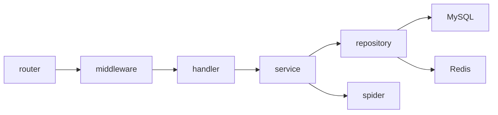
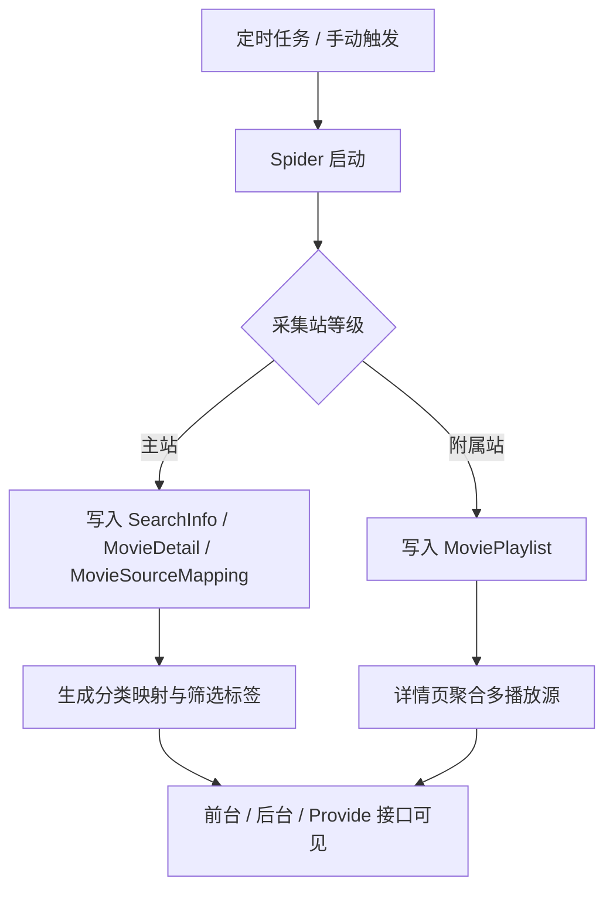

# Server

`server/` 是 EcoHub 的 Go 服务端，负责：

- 采集源管理与数据采集
- 影片检索、详情聚合、播放源聚合
- 分类映射与联动筛选
- 管理后台接口
- TVBox / MacCMS 兼容接口
- 登录态与后台鉴权

## 服务端架构



## 运行要求

- Go 1.24+
- MySQL 8+
- Redis 7+

## 本地启动

推荐直接使用项目内脚本：

```bash
cd server
./run-local.sh
```

脚本会：

- 加载 `server/.env`
- 执行 `go run ./cmd/server`

适用范围：

- 适用于已安装 Bash 和 Go 的 macOS、Linux、WSL、Git Bash 等环境
- 不适用于 Windows 原生 `cmd` / PowerShell
- Windows 原生环境建议改用 Docker，或先自行注入 `.env` 中的环境变量后再执行 `go run ./cmd/server`

如果你想手动启动：

```bash
cd server
set -a
source .env
set +a
go run ./cmd/server
```

服务监听地址由 `PORT` 或 `LISTENER_PORT` 决定。
如果同时配置了 `PORT` 和 `LISTENER_PORT`，当前实现会优先使用 `PORT`。

## 环境变量

本地运行使用 `server/.env`，Docker 运行使用根目录 `.env`。字段保持一致。

| 变量 | 必填 | 说明 |
| --- | --- | --- |
| `PORT` | 条件必填 | 服务监听端口，优先级高于 `LISTENER_PORT` |
| `LISTENER_PORT` | 条件必填 | 当未设置 `PORT` 时使用的监听端口 |
| `JWT_SECRET` | 是 | JWT 签名密钥，未配置会直接启动失败 |
| `MYSQL_HOST` | 是 | MySQL 地址 |
| `MYSQL_PORT` | 是 | MySQL 端口 |
| `MYSQL_USER` | 是 | MySQL 用户 |
| `MYSQL_PASSWORD` | 否 | MySQL 密码 |
| `MYSQL_DBNAME` | 是 | 业务库名 |
| `REDIS_HOST` | 是 | Redis 地址 |
| `REDIS_PORT` | 是 | Redis 端口 |
| `REDIS_PASSWORD` | 否 | Redis 密码 |
| `REDIS_DB` | 否 | Redis DB，默认 `0` |
| `ENV` | 否 | 设置为 `dev` 时启用开发模式 |
| `IS_DEV_MODE` | 否 | 设置为 `true` 时同样启用开发模式 |

### 开发模式说明

`ENV=dev` 或 `IS_DEV_MODE=true` 时：

- 启动时会清空 Redis
- 启动时会重置 MySQL
- 有删库建库权限时执行物理重建
- 没有删库权限时退化为清空现有表

这适合本地调试，不适合保留数据的环境。

## 启动后初始化

服务启动后会按当前数据库状态执行这些初始化逻辑：

- 等待 Redis 和 MySQL 可用
- 首次启动时建表；常规重启时执行 `AutoMigrate`
- 初始化映射引擎、标准大类和分类缓存
- 初始化内置账号、基础站点配置和默认轮播图
- 初始化默认采集源和定时任务
- 启动 cron 调度器

当前代码会自动补齐两个内置账号：

| 类型 | 账号 | 密码 | 权限 |
| --- | --- | --- | --- |
| 管理员 | `admin` | `admin` | 可读可写 |
| 访客 | `guest` | `guest` | 只读 |

## 采集与聚合逻辑



当前实现有几个关键约束：

- 任意时刻只允许一个主站
- 站点升级为主站时，会自动降级旧主站
- 主站变更或主站 URI 变更时，会停止采集任务并清空主数据，再由新主站重建
- 内容归并优先使用豆瓣 ID，没有豆瓣 ID 时使用片名哈希
- 附属站播放源聚合时，也按豆瓣 ID 和标题候选哈希去匹配

## 接口分组

### 公共接口

这类接口不要求登录：

- `/api/index`
- `/api/navCategory`
- `/api/filmDetail`
- `/api/filmPlayInfo`
- `/api/searchFilm`
- `/api/filmClassify`
- `/api/filmClassifySearch`
- `/api/proxy/video`
- `/api/config/basic`
- `/api/provide/vod`
- `/api/provide/config`

### 登录相关接口

- `POST /api/login`
- `POST /api/logout`

其中 `/api/logout` 需要已登录。

### 后台接口

`/api/manage/*` 全部挂载了鉴权中间件，覆盖这些模块：

- 首页概览
- 站点配置
- 轮播管理
- 用户管理
- 采集源与失败记录
- 定时任务
- Spider 操作
- 影片管理
- 文件管理

## 鉴权模型

当前后台鉴权流程如下：

1. `POST /api/login` 登录成功
2. 后端下发 `HttpOnly` cookie：`ecohub_auth_token`
3. `/api/manage/*` 和 `/api/logout` 由后端中间件校验 cookie 中的 JWT
4. JWT 通过后，还会继续校验 Redis 中保存的当前有效 token
5. JWT 已过期但 Redis 中 token 仍有效时，会自动刷新 cookie

这意味着：

- 前端不维护 localStorage token
- 后端是唯一真实鉴权边界
- 账号在其他设备重新登录后，旧 token 会失效
- 访客账号可以读，但写操作会被 `WriteAccess` 拦截

## 主要目录

```text
server/
├── cmd/server/             # 入口
├── internal/config/        # 配置与常量
├── internal/router/        # 路由
├── internal/middleware/    # CORS / JWT
├── internal/handler/       # HTTP 处理层
├── internal/service/       # 业务逻辑
├── internal/repository/    # 数据访问层
├── internal/model/         # 数据模型与 DTO
├── internal/spider/        # 采集与转换
├── internal/infra/db/      # MySQL / Redis 初始化
└── internal/utils/         # 工具函数
```

## 常用开发命令

```bash
cd server
go test ./...
```

如果本地 Go 缓存目录受限，可显式指定：

```bash
cd server
GOCACHE=/tmp/ecohub-go-cache go test ./...
```

## 相关文档

- [根目录说明](../README.md)
- [前端说明](../web/README.md)
- [Docker 部署说明](../README-Docker.md)
- [FAQ 与排障](../README-FAQ.md)
