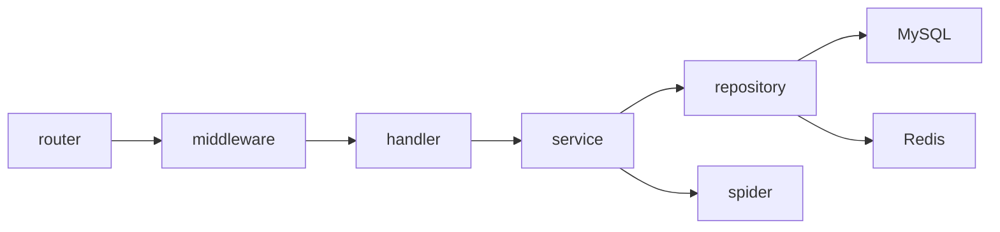
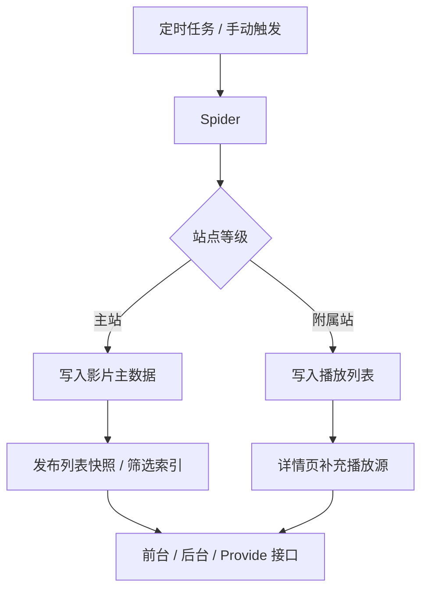
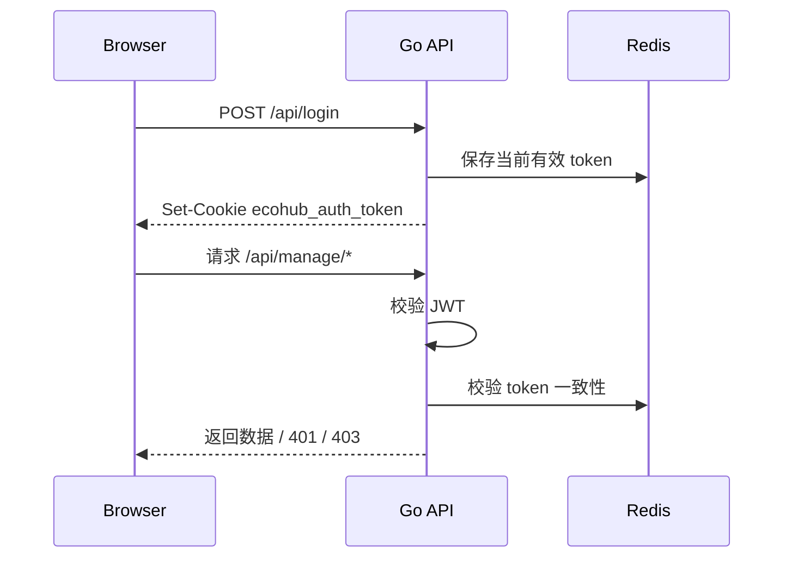

# Server

`server/` 是 EcoHub 的 Go API 服务，负责采集、归并、列表快照、缓存、开放接口和后台鉴权。

## 职责边界

- 采集源管理与 Spider 调度。
- 主站影片主数据入库。
- 附属站播放列表补源。
- 影片搜索、详情聚合、播放源聚合。
- 分类映射、筛选标签、列表快照和倒排索引。
- 管理后台 API、登录态、访客只读权限。
- TVBox / MacCMS 兼容接口。

## 架构概览



## 运行要求

- Go 1.24+
- MySQL 8+
- Redis 7+

## 本地启动

### 1. 准备环境变量

```bash
cd server
cp .env.example .env
```

最小配置示例：

```env
PORT=8080
JWT_SECRET=change_me_to_a_long_random_string

MYSQL_HOST=127.0.0.1
MYSQL_PORT=3306
MYSQL_USER=eco
MYSQL_PASSWORD=your_mysql_password
MYSQL_DBNAME=eco

REDIS_HOST=127.0.0.1
REDIS_PORT=6379
REDIS_PASSWORD=your_redis_password
REDIS_DB=0
```

`JWT_SECRET` 必须使用高强度随机值，可用下面命令生成：

```bash
openssl rand -hex 32
```

### 2. 启动服务

```bash
cd server
go run ./cmd/server
```

服务启动时会自动读取 `server/.env`。

### 3. 启动结果

- API 默认监听 `8080`，由 `PORT` 决定。
- 启动阶段会连接 MySQL 和 Redis，不可达会直接退出。
- 首次启动会自动建表、初始化基础配置、默认站点、内置账号和定时任务。

## 环境变量

| 变量 | 必填 | 说明 |
| --- | --- | --- |
| `PORT` | 是 | API 监听端口 |
| `JWT_SECRET` | 是 | JWT 签名密钥，未配置会启动失败 |
| `MYSQL_HOST` | 是 | MySQL 地址 |
| `MYSQL_PORT` | 是 | MySQL 端口 |
| `MYSQL_USER` | 是 | MySQL 用户 |
| `MYSQL_PASSWORD` | 否 | MySQL 密码 |
| `MYSQL_DBNAME` | 是 | 业务库名 |
| `REDIS_HOST` | 是 | Redis 地址 |
| `REDIS_PORT` | 是 | Redis 端口 |
| `REDIS_PASSWORD` | 否 | Redis 密码 |
| `REDIS_DB` | 否 | Redis DB，默认 `0` |

常见地址写法：

- MySQL / Redis 在本机：`127.0.0.1`
- MySQL / Redis 在另一台机器：填写内网 IP、域名或公网地址
- Docker Compose 内部访问：`mysql`、`redis`
- 容器访问宿主机服务：`host.docker.internal`

## 启动初始化

服务启动后会执行这些初始化动作：

- 等待 MySQL 和 Redis 可用。
- 执行 `AutoMigrate`。
- 清理项目自身缓存。
- 初始化映射引擎、标准大类、分类缓存。
- 初始化内置账号、基础站点配置、默认轮播图。
- 初始化默认采集源和定时任务。
- 加载或构建前台列表快照、筛选项和读模型。
- 启动 cron 调度器。

## 采集模型



核心约束：

- 任意时刻只允许一个主站。
- 主站负责影片主数据和检索入口。
- 附属站只补充播放列表。
- 内容归并优先使用豆瓣 ID，缺失时使用内容指纹。
- 主站切换或主站 URI 变更会停止采集并重建主数据。
- 后台支持对单部影片触发全部站点更新。

## 快照与缓存

前台列表不直接扫描采集中的临时状态，而是读取发布后的快照和读模型：

- `film_index` 保存影片检索入口。
- `film_list_snapshot` 保存前台列表快照。
- `film_filter_index_snapshot` 保存筛选倒排索引。
- 活跃快照版本记录在 Redis。
- 增量发布按 affected mids 分批处理数据库 SQL，事务成功后一次性刷新内存读模型。

缓存策略：

- 服务启动时只清理 EcoHub 自身缓存。
- 分类重建、主站切换、快照发布后会刷新相关缓存。
- 首页、筛选配置、TVBox 列表会跟随快照发布收敛。

## 分类、筛选与排序

公共分类搜索、后台列表和 TVBox 列表使用同一套后端语义：

- 分类优先使用来源分类映射。
- 剧情、地区、语言、年份支持“其他”。
- 排序包含最近更新、人气、评分、时间。
- 最近更新只看主站资源更新时间，不受附属播放源同步影响。

## 接口分组

公共接口：

- `/api/index`
- `/api/navCategory`
- `/api/filmDetail`
- `/api/filmPlayInfo`
- `/api/searchFilm`
- `/api/filmClassify`
- `/api/filmClassifySearch`
- `/api/proxy/video`
- `/api/config/basic`
- `/api/provide/vod`
- `/api/provide/config`

登录接口：

- `POST /api/login`
- `POST /api/logout`

后台接口：

- `/api/manage/*`

后台接口覆盖首页概览、站点配置、轮播、用户、采集源、失败记录、定时任务、Spider 操作、影片管理和文件管理。

## 鉴权模型



- 登录态使用 `HttpOnly` cookie：`ecohub_auth_token`。
- 后端是最终鉴权边界。
- `/api/manage/*` 和 `/api/logout` 会校验 JWT 与 Redis 中的当前 token。
- JWT 过期但 Redis token 仍有效时，会自动刷新 cookie。
- 访客账号可以读取后台数据，写操作会被 `WriteAccess` 拦截。

## 默认账号

| 类型 | 账号 | 密码 | 权限 |
| --- | --- | --- | --- |
| 管理员 | `admin` | `admin` | 可读可写 |
| 访客 | `guest` | `guest` | 只读 |

默认账号仅适合初始化和演示。对外部署后请立即修改密码。

## 主要目录

```text
server/
├── cmd/server/             # 入口
├── internal/config/        # 配置与常量
├── internal/router/        # 路由
├── internal/middleware/    # CORS / JWT / 写权限
├── internal/handler/       # HTTP 处理层
├── internal/service/       # 业务逻辑
├── internal/repository/    # 数据访问层
├── internal/model/         # 数据模型与 DTO
├── internal/spider/        # 采集与转换
├── internal/infra/db/      # MySQL / Redis 初始化
└── internal/utils/         # 工具函数
```

## 常用命令

```bash
cd server
go run ./cmd/server
go test ./...
```

如果本地 Go 缓存目录受限：

```bash
cd server
GOCACHE=/tmp/ecohub-go-cache go test ./...
```

## 相关文档

- [根目录总览](../README.md)
- [前端说明](../web/README.md)
- [Docker 部署说明](../README-Docker.md)
- [FAQ 与排障](../README-FAQ.md)
