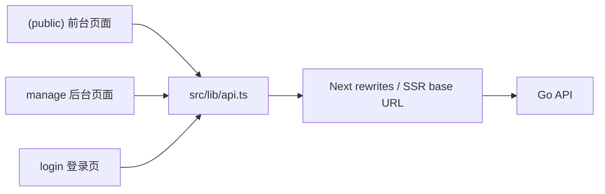
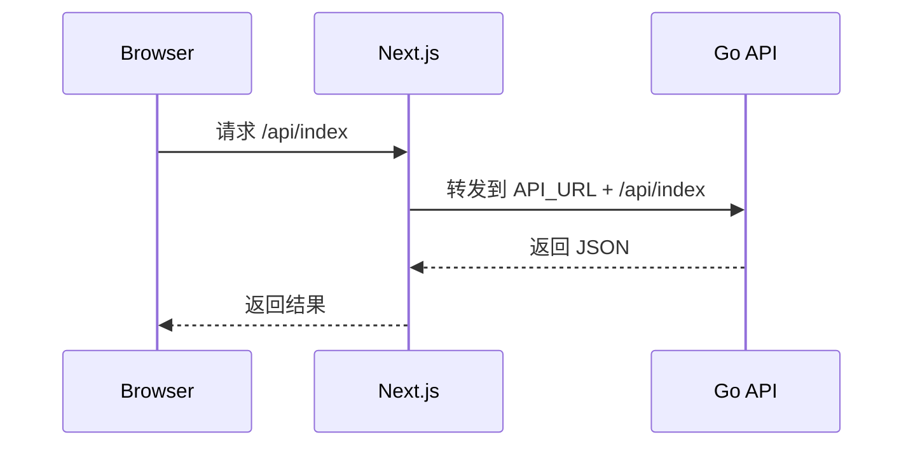

# Web

`web/` 是 EcoHub 的 Next.js 前端，包含：

- 前台站点
- 登录页
- 管理后台

## 前端结构图



## 技术栈

- Next.js 16.1.6
- React 19.2.3
- TypeScript
- Ant Design 6
- Axios
- Less / CSS Modules
- Artplayer / Hls.js

## 本地运行

### 1. 安装依赖

```bash
cd web
npm install
```

### 2. 配置 `API_URL`

在 `web/.env.local` 中配置：

```env
API_URL=http://your-api-origin
```

`API_URL` 是必填项，且必须指向后端入口。当前实现下：

- 运行 `next dev` 时如果缺失会直接报错
- 运行 `next build` 时如果缺失也会直接报错
- 服务端渲染请求同样依赖它

### 3. 启动开发环境

```bash
cd web
npm run dev
```

前台入口跟随 Next 开发服务地址，后台路径固定为 `/manage`，登录页为 `/login`。

## `API_URL` 在当前实现里的作用

前端代码中的请求大多写成相对路径 `/api/*`，但客户端和服务端的处理方式并不完全一样：

- 浏览器端请求走 `/api/*`，由 Next rewrites 代理到后端
- SSR 环境不会经过浏览器，因此会直接把 `API_URL` 拼成 `${API_URL}/api`
- 因此 `API_URL` 同时影响 rewrites 和服务端取数



## 目录结构

```text
web/
├── src/app/
│   ├── (public)/           # 前台页面
│   ├── login/              # 登录页
│   └── manage/             # 后台页面
├── src/components/         # 业务组件
├── src/lib/                # API 封装、消息、公共逻辑
├── src/proxy.ts            # /manage 路由预拦截
├── next.config.ts          # API rewrites 与构建配置
└── package.json
```

## 请求与鉴权

### API 请求

- 浏览器端请求默认走 `/api/*`
- Next 根据 `API_URL` 做代理转发
- SSR 请求直接使用 `${API_URL}/api`

### 后台访问控制

- `/manage` 路由由 `src/proxy.ts` 做预拦截
- 这里仅检查 `ecohub_auth_token` cookie 是否存在
- 不做角色校验，也不验证 token 真伪
- 真正的 token 校验、自动续期和写权限控制都在后端完成

这意味着：

- 前端预拦截主要用于未登录时的快速跳转
- 后端接口才是最终权限边界
- 客户端 `axios` 拦截器会在 `401` 时跳转 `/login`，在 `403` 时提示无权限

## 常用命令

```bash
cd web
npm run dev
npm run build
npm run start
npm run lint
```

## 当前约束

- `API_URL` 缺失时，开发和构建都会直接失败
- 管理后台依赖后端下发的 `HttpOnly` cookie 登录态
- 如果后端入口变化，需要同步更新环境变量并重新启动前端

## 相关文档

- [根目录说明](../README.md)
- [服务端说明](../server/README.md)
- [Docker 部署说明](../README-Docker.md)
- [FAQ 与排障](../README-FAQ.md)
