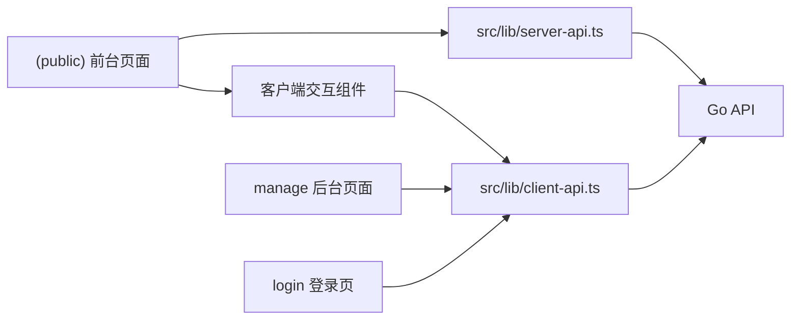
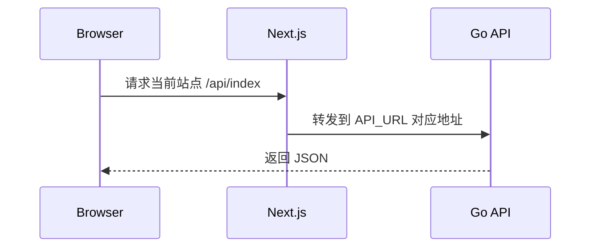

# Web

`web/` 是 EcoHub 的 Next.js 前端，包含：

- 前台站点
- 登录页
- 管理后台

## 前端结构图



## 技术栈

- Next.js 16.1.6
- React 19.2.3
- TypeScript
- Ant Design 6
- Axios
- Less / CSS Modules
- Artplayer / Hls.js

## 本地运行

### 1. 安装依赖

```bash
cd web
npm install
```

### 2. 配置 API 地址

前端现在只要求显式配置 `API_URL`。

前端开发服务端口与后端 API 端口不是同一个概念：

- `web/.env.local` 中的 `PORT` 用于 Next 开发服务
- `web/.env.local` 中的 `API_URL` 用于 Next 转发浏览器端 `/api` 请求

推荐先复制示例文件：

```bash
cd web
cp .env.example .env.local
```

本地开发常见配置：

```env
PORT=3000
API_URL=http://127.0.0.1:8080
```

如果是 Docker、反向代理或跨机器访问，请改成实际可访问地址：

```env
API_URL=http://server:8080
```

- 当前实现已拆分 `server-api` 与 `client-api`，分别服务于服务端取数和客户端交互
- 浏览器端默认请求当前站点下的 `/api/*`，再由 Next rewrite 转发到 `API_URL`
- 大多数情况下只需要配置 `API_URL`
- Docker 场景下，`API_URL` 推荐直接写容器内可访问地址，例如 `http://server:8080`

### 3. 启动开发环境

```bash
cd web
npm run dev
```

Next 会自动加载 `web/.env.local`。

### 4. 启动成功后

- 默认访问地址是 `http://127.0.0.1:3000`
- 后台地址固定为 `/manage`
- 登录页固定为 `/login`
- 如果后端地址改了，记得同步修改 `web/.env.local` 中的 `API_URL`

## API 地址在当前实现里的作用

前端代码中的请求会按职责分层后走后端绝对地址：

- 公共内容页优先在 Server Component 中通过 `src/lib/server-api.ts` 取数
- 客户端交互与后台请求通过 `src/lib/client-api.ts` 发起
- `API_URL` 同时用于 Next 转发浏览器端请求和服务端取数



## 目录结构

```text
web/
├── src/app/
│   ├── (public)/           # 前台页面
│   ├── login/              # 登录页
│   └── manage/             # 后台页面
├── src/components/         # 业务组件
├── src/lib/                # API 封装、消息、公共逻辑
├── src/proxy.ts            # /manage 路由预拦截
├── next.config.ts          # Next 构建配置
└── package.json
```

## 请求与鉴权

### API 请求

- `(public)` 目录下的内容页默认使用 Server Component 做首屏取数
- `manage`、`login`、`play` 等强交互页面继续使用 Client Component
- `src/lib/server-api.ts` 负责服务端读接口
- `src/lib/client-api.ts` 负责浏览器端交互请求与错误处理
- `API_URL` 为必填项

### 后台访问控制

- `/manage` 路由由 `src/proxy.ts` 做预拦截
- 这里仅检查 `ecohub_auth_token` cookie 是否存在
- 不做角色校验，也不验证 token 真伪
- 真正的 token 校验、自动续期和写权限控制都在后端完成
- 如果前端与后端不是同源部署，需要额外确保跨域 cookie 与 CORS 配置正确

这意味着：

- 前端预拦截主要用于未登录时的快速跳转
- 后端接口才是最终权限边界
- 客户端 `axios` 拦截器会在 `401` 时跳转 `/login`，在 `403` 时提示无权限

## 常用命令

```bash
cd web
npm run dev

cd web
npm run build
npm run start
npm run lint
```

## Docker 运行

如果你通过仓库根目录的 Compose 启动前端，请在根目录执行：

```bash
docker compose --env-file server/.env up --build -d web
```

如果还要同时启动后端：

```bash
docker compose --env-file server/.env up --build -d server web
```

如果要连同 Compose 内置的 MySQL / Redis 一起启动：

```bash
docker compose --env-file server/.env up --build -d mysql redis server web
```

Docker 场景下请重点确认 `web/.env.production`：

- `API_URL`：Next 容器可访问的后端地址，默认可直接写 `http://server:8080`

## 当前约束

- 管理后台依赖后端下发的 `HttpOnly` cookie 登录态
- 如果后端入口变化，需要同步更新环境变量并重新启动前端

## 相关文档

- [根目录说明](../README.md)
- [服务端说明](../server/README.md)
- [Docker 部署说明](../README-Docker.md)
- [FAQ 与排障](../README-FAQ.md)
