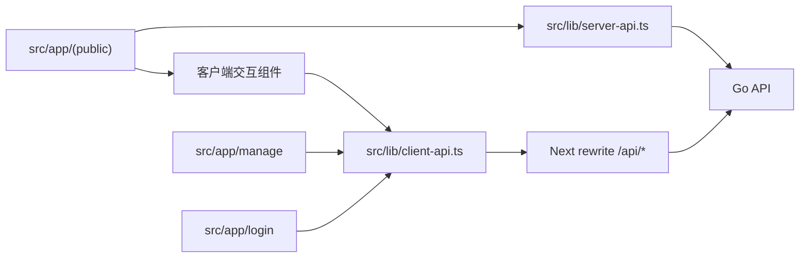
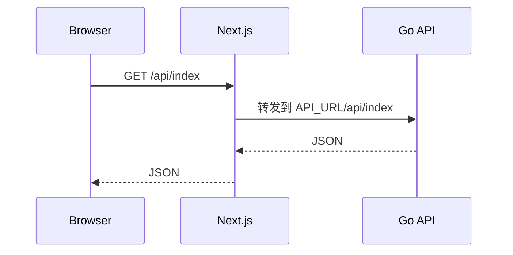

# Web

`web/` 是 EcoHub 的 Next.js 前端，包含前台站点、登录页和管理后台。

## 职责边界

- 前台首页、分类页、搜索页、详情页、播放页。
- 登录页和后台管理页面。
- 浏览器端 `/api/*` 请求转发。
- Server Component 首屏取数。
- 后台登录态预拦截和客户端错误处理。

## 技术栈

- Next.js 16.1.6
- React 19.2.3
- TypeScript
- Ant Design 6
- Axios
- Less / CSS Modules
- Artplayer / Hls.js

## 架构概览



## 本地启动

### 1. 安装依赖

```bash
cd web
npm install
```

### 2. 准备环境变量

```bash
cd web
cp .env.example .env.local
```

默认示例：

```env
PORT=3000
API_URL=http://127.0.0.1:8080
```

`API_URL` 必须指向 Next 服务端能够访问到的 Go API 地址。

### 3. 启动开发服务

```bash
cd web
npm run dev
```

默认访问：

- 前台：`http://127.0.0.1:3000`
- 登录页：`http://127.0.0.1:3000/login`
- 后台：`http://127.0.0.1:3000/manage`

## 环境变量

| 变量 | 必填 | 说明 |
| --- | --- | --- |
| `PORT` | 否 | Next 监听端口，默认 `3000` |
| `API_URL` | 是 | Go API 地址，用于服务端取数和 `/api/*` 转发 |

常见配置：

1. 前后端都在本机：

```env
PORT=3000
API_URL=http://127.0.0.1:8080
```

2. 后端在另一台机器：

```env
PORT=3000
API_URL=http://192.168.1.20:8080
```

3. Docker Compose 容器网络：

```env
API_URL=http://server:${SERVER_PORT:-8080}
```

## API 请求模型

浏览器端默认请求当前站点下的 `/api/*`，Next 再转发到 `API_URL`。



代码分层：

- `src/lib/server-api.ts`：Server Component 取数。
- `src/lib/client-api.ts`：浏览器端交互请求。
- `next.config.ts`：配置 `/api/*` rewrite。
- `src/proxy.ts`：后台路由预拦截。

## 鉴权边界

- 登录态由后端下发 `HttpOnly` cookie：`ecohub_auth_token`。
- `/manage` 只在 `src/proxy.ts` 中检查 cookie 是否存在。
- 前端不验证 token 真伪，不做最终权限判断。
- `/api/manage/*` 的 JWT 校验、Redis token 校验、写权限控制都在后端完成。
- 客户端请求收到 `401` 会跳转 `/login`，收到 `403` 会提示无权限。

## 目录结构

```text
web/
├── src/app/
│   ├── (public)/           # 前台页面
│   ├── login/              # 登录页
│   └── manage/             # 后台页面
├── src/components/         # 业务组件
├── src/lib/                # API 封装、消息、公共逻辑
├── src/proxy.ts            # /manage 路由预拦截
├── next.config.ts          # Next 构建与 rewrite 配置
├── package.json
└── Dockerfile
```

## 常用命令

```bash
cd web
npm run dev
npm run build
npm run start
npm run lint
```

## 注意事项

- `API_URL` 改动后需要重启 Next 服务。
- Docker 中的 `127.0.0.1` 指向 `web` 容器自身，不是 `server` 容器。
- 后台页面能打开不代表接口鉴权一定有效，最终以后端接口返回为准。
- 如果前后端跨域部署，需要额外确认 cookie、CORS 和反向代理配置。

## 相关文档

- [根目录总览](../README.md)
- [服务端说明](../server/README.md)
- [Docker 部署说明](../README-Docker.md)
- [FAQ 与排障](../README-FAQ.md)
