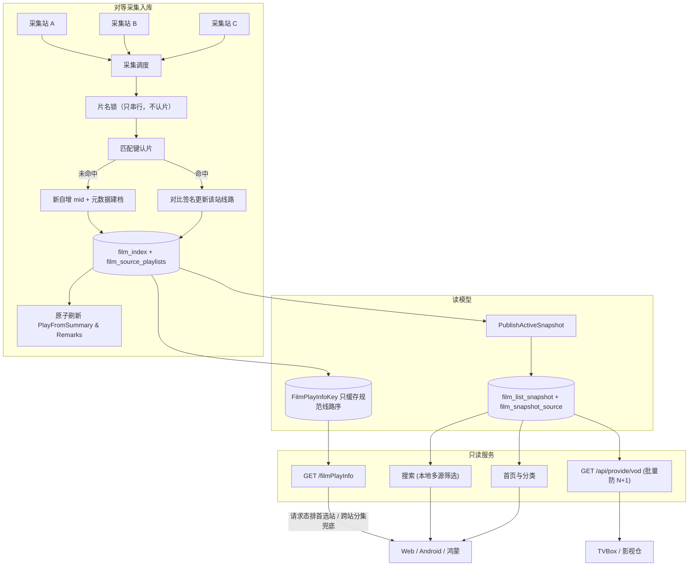
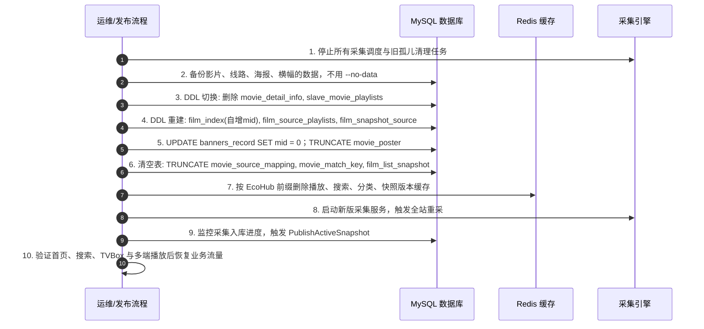

# EcoHub 全采集站统一聚合片库与对等多源调度技术实现方案

本方案是破坏性大版本，不做旧数据兼容，不做双读，不保留旧 `mid`。

上线后旧书签、旧 TVBox 收藏里的 `vod_id`、现场播放入口全部失效。通过停机换表、重置运营外键、清空缓存、全量重采完成切换。

---

## 1. 现状与目标

### 1.1 代码里的现状

当前是单主站写入骨架、附属站只补线路：

1. **主站 `mid` 就是源站 `vod_id`。** `buildFilmIndex` 把 `detail.Id` 写入 `FilmIndex.Mid`。`Mid` 不是自增主键，真正的主键是 `gorm.Model.ID`，`Mid` 只是唯一索引。`ContentKey` 优先为 `vod_{源站vod_id}`，无源站 ID 时才退成 `name_{hash}`。豆瓣 ID 和规范化片名只进 `movie_match_key`，不能当主键。同名近似片靠 `vod_` 前缀区分，避免互相覆盖。
2. **播放列表分两套物理表。** 主站整份详情 JSON 在 `movie_detail_info.content`。附属站在 `slave_movie_playlists`，唯一键是 `(source_id, movie_key, group_index)`，`movie_key` 是匹配键哈希，不是 `mid`。读详情时 `multipleSource` 用匹配键把附属站线路拼到主站线路后面。
3. **站点等级决定写路径和分类树。** `saveCollectedFilmForCollect` 看到 `Grade != MasterCollect` 就只写附属站线路。新增主站会降级旧主站并清主站数据。分类树只从主站 `SyncMasterCategoryTree` 同步。`FilmSource` 没有 `Weight`。`IsPosterSource` 是全局单选海报源，不是多站加权封面。
4. **未匹配附属站线路会丢。** `CleanOrphanPlaylists` 每天 04:35 跑，宽限 24 小时，单次最多删 5000 行、最长 10 秒。未挂上主站匹配键的线路进不了首页、分类和 TVBox。
5. **搜索和 TVBox 的 `source` 今天是实时穿透，不是本地筛选。** `SearchFilm` 在 `source` 为空时查 `film_list_snapshot` 的片名 `LIKE`；`source` 非空时调用 `searchCollectSourceCMS` 打源站 `ac=list&wd=`。`GET /api/provide/vod?source=` 走 `GetVodDirectBySource` 原样转发。`GET /filmPlayInfo` 只读本地库；`GET /liveFilmPlayInfo` 用 `source + sid` 现场拉第三方，不入库。
6. **播放缓存按 `mid` 存整页，和观众偏好无关。** `GetFilmDetail` 用 `FilmPlayInfoKey:{mid}` 缓存约 12 小时。`playFrom` 与播放页查询参数 `source` 存在命名重叠与语义混淆。

### 1.2 目标



### 1.3 设计原则

1. **没有主站和附属站。** 删除 `SourceGrade`。任一启用站点首次命中新片都可以建档，之后命中的站点只补线路和空字段。
2. **运行时不再请求第三方 CMS。** 删除 `searchCollectSourceCMS`、`GetVodDirectBySource`、`LiveFilmPlayInfo`，以及 Web 播放页现场播放的跳转分支。
3. **展示元数据和线路分开存。** 片名、海报、分类、简介在 `film_index`。每个站点的播放和下载线路在 `film_source_playlists`。链接存原始地址，域名替换在读路径按该站 `DomainReplaceRules` 动态处理。
4. **首选站是请求态，参数命名严格隔离。** `playFrom` 仅用于明确指定线路；`preferredSource` 仅用于传递观众首选站点。排序发生在 `GetFilmDetail` 返回之后的请求副本上，Redis 缓存只放规范权重序。
5. **片名锁只负责串行。** 锁键是 `NormalizeIdentityTitle` 之后的片名主干，有豆瓣 ID 和没有豆瓣 ID 的两站拿同一把锁。锁不表示两部片子是同一部。能不能并进已有 `mid` 只看 3.2 的独占匹配键。纯片名键不参与自动合并。
6. **线路签名覆盖原始播放地址。** `ContentHash` 含 `line_kind`、`group_index`、`group_name` 和分集原文（`episode` 与 `link`）。URL 变了必须重写。签名一致才跳过 `DELETE + INSERT`。
7. **大版本直接换表。** 不双写旧表，清理旧关联外键与无用模型。

---

## 2. 数据模型

### 2.1 `film_sources`：去掉等级，加上权重

修改 `server/internal/model/spider.go` 的 `FilmSource`。删除 `Grade` 和废弃的 `SyncPictures`。`IsPosterSource` 维持全局单一封面源逻辑：设为 true 时清掉其他站的该标记。

```go
type FilmSource struct {
	Id                 string    `json:"id" gorm:"primaryKey;size:32"`
	Name               string    `json:"name" gorm:"size:64"`
	Uri                string    `json:"uri" gorm:"uniqueIndex;size:255"`
	State              bool      `json:"state"`
	Weight             int       `json:"weight" gorm:"default:0"` // 线路排序默认权重，越大越靠前
	IsPosterSource     bool      `json:"isPosterSource" gorm:"default:false"`
	Interval           int       `json:"interval"`
	Cd                 int       `json:"cd"`
	Format             string    `json:"format" gorm:"size:16;default:'json'"`
	DomainReplaceRules string    `json:"domainReplaceRules" gorm:"type:text"`
	CreatedAt          time.Time `json:"createdAt" gorm:"autoCreateTime;<-:create;index"`
}
```

### 2.2 `film_index`：新自增 `mid`，收拢详情字段，删除 `movie_detail_info`

破坏性变更：
- 去掉 `gorm.Model`。`Mid` 成为唯一自增主键。`CreatedAt`、`UpdatedAt` 用 `time.Time`。`DeletedAt` 必须是 `gorm.DeletedAt`，不能是 `time.Time`，否则软删除过滤不会生效。
- 删除 `ContentKey` 和 `SourceId`。
- 增加 `FirstSourceId`，建档时写入，后续不变更。
- 将原 `movie_detail_info` JSON 里的详情展示字段抬升到主表：`Content`、`Writer`、`ReleaseDate`。
- 物理删除表 `movie_detail_info`。

```go
type FilmIndexIdentity struct {
	Mid           int64  `json:"mid" gorm:"primaryKey;autoIncrement"`
	FirstSourceId string `json:"firstSourceId" gorm:"size:32;index"`
	DbId          int64  `json:"dbId" gorm:"index"`
}

type FilmIndex struct {
	CreatedAt time.Time
	UpdatedAt time.Time
	DeletedAt gorm.DeletedAt `gorm:"index"`
	FilmIndexIdentity
	FilmIndexCategory
	FilmIndexContent
	FilmIndexVersion
	FilmIndexDerived
}
```

元数据更新规则：
- 首发站点写入采到的非空字段。
- 后续站点只填补空字段：`Actor`、`Director`、`Writer`、`Blurb`、`Content`、`ReleaseDate`、`Year == 0`、`DbId == 0`。
- 已有片名、年份、分类不被后续站点覆盖。
- 全局海报源采到该片且未锁人工自定义海报时，覆盖 `Picture` 与 `PictureSlide`。
- `Remarks` 只统计 `line_kind = play`。取 `EpisodeCount` 最大的一路；并列时站点权重更高者优先，再取更小的 `group_index`。文案用该行的 `LastEpisode`。
- `PlayFromSummary` 是每条播放线路一个展示名，用 `BuildDisplaySourceName`，不是每个站点折成一个名字。库内按写入当时的权重和 `group_index` 保存，包含当时已停用的站点。列表、详情和快照发布时再丢掉 `State = false` 的站点，并按当前权重重排。修改站点权重或启用状态时，用 `idx_playlist_source_mid` 找出该站出现过的 `mid`，重算这些卡片的摘要并发布快照，不能等下次采集。

### 2.3 `movie_source_mapping`：清理并建立内部映射

清空存量数据。`SourceMid` 为源站 `vod_id`，`GlobalMid` 为系统自增 `mid`。`detail.Id <= 0` 直接丢弃不建档。

复合索引的每一列都要写同一个索引名，并且 `priority` 从 1 连续编号。只在一列上写 `priority:1`，GORM 不会把另一列收进该索引。

```go
type MovieSourceMapping struct {
	gorm.Model
	SourceId  string `gorm:"size:32;uniqueIndex:uidx_source_mid,priority:1;index:idx_global_source,priority:2"`
	SourceMid int64  `gorm:"uniqueIndex:uidx_source_mid,priority:2"`
	GlobalMid int64  `gorm:"index:idx_global_source,priority:1"`
}
```

`uidx_source_mid` 是 `(source_id, source_mid)`。`idx_global_source` 是 `(global_mid, source_id)`。

### 2.4 `film_source_playlists`：统一多源线路存储

替代 `movie_detail_info` 内的 JSON 播放字段与整张 `slave_movie_playlists`。物理删除旧表 `slave_movie_playlists`。

```go
type FilmSourcePlaylist struct {
	ID           uint      `gorm:"primaryKey"`
	CreatedAt    time.Time
	UpdatedAt    time.Time
	Mid          int64  `gorm:"uniqueIndex:uidx_mid_source_kind_group,priority:1;index:idx_playlist_mid;index:idx_playlist_source_mid,priority:2"`
	SourceId     string `gorm:"size:32;uniqueIndex:uidx_mid_source_kind_group,priority:2;index:idx_playlist_source_mid,priority:1"`
	LineKind     string `gorm:"size:16;uniqueIndex:uidx_mid_source_kind_group,priority:3"` // play 或 download
	GroupIndex   int    `gorm:"uniqueIndex:uidx_mid_source_kind_group,priority:4"`
	GroupName    string    `gorm:"type:varchar(255)"`
	EpisodeCount int       `gorm:"default:0"`
	LastEpisode  string    `gorm:"size:64"`
	ContentHash  string    `gorm:"size:32"` // line_kind、group_index、group_name、Content 原文的 MD5
	Content      string    `gorm:"type:longtext"` // 原始 []MovieUrlInfo JSON，含 episode 与 link
}
```

`uidx_mid_source_kind_group` 是 `(mid, source_id, line_kind, group_index)`。`idx_playlist_source_mid` 是 `(source_id, mid)`。

### 2.5 匹配键：`movie_match_key`

保留 `BuildMovieMatchKeysWithCategory` 的三层哈希：
1. 豆瓣身份键：`BuildCollectionDbIdentity(dbId, name)`。无片名时会退化成裸 `dbid_{id}`，这个键禁止参与自动合并。
2. 分类身份键：`规范化片名#cat_{pid}`。同一个键已经指向多个 `mid` 时，该键作废。
3. 纯片名键：只留给详情展示侧的 `DropSharedMatchKeys`。入库合并不用它。同名电影和电视剧靠分类键分开；若用「当前只有一个主人」的纯片名键去合并，后到的另一类会被并进先建的那一条。

唯一约束保持 `(mid, match_key)`。纯片名键仍然可以属于多部片子，不能改成全局唯一。

### 2.6 快照与成员关系表

`film_list_snapshot` 移除 `ContentKey` 和 `SourceId`。新增快照版本成员关系表：

```go
type FilmSnapshotSource struct {
	ID              uint   `gorm:"primaryKey"`
	SnapshotVersion string `gorm:"size:64;uniqueIndex:uidx_snap_source_mid,priority:1;index:idx_snap_ver_source,priority:1"`
	Mid             int64  `gorm:"uniqueIndex:uidx_snap_source_mid,priority:2"`
	SourceId        string `gorm:"size:32;uniqueIndex:uidx_snap_source_mid,priority:3;index:idx_snap_ver_source,priority:2"`
}
```

`uidx_snap_source_mid` 是 `(snapshot_version, mid, source_id)`。没有 `priority` 时，GORM 可能把唯一约束落成单独的 `snapshot_version`，一个版本就只能有一行。`idx_snap_ver_source` 是 `(snapshot_version, source_id)`，给按站点筛选搜索用。

快照版本淘汰时，`film_snapshot_source` 必须与 `film_list_snapshot` 同步级联分批物理删除，避免孤儿数据膨胀。

---

## 3. 采集入库

### 3.1 并发互斥与事务控制

多站点同时采集时，使用**清洗后的片名主干**作为锁键，消除不同站点因豆瓣 ID 残缺而产生的锁分叉问题：

```go
func getFilmIdentityLockKey(name string) string {
	clean := utils.NormalizeIdentityTitle(name)
	if clean == "" {
		clean = strings.TrimSpace(name)
	}
	return "lock:film:ident:" + utils.GenerateHashKey(clean)
}
```

锁与事务执行流程：

1. 单片获取该片名对应的进程内互斥锁（或分布式 `GET_LOCK`）。用 `defer` 释放，失败和 panic 也要放锁。
2. 再获取当前站点的写锁 `getSourceWriteLock(source.Id)`。顺序固定为先身份锁、后站点锁。
3. 开启独立单片事务。死锁（1213）和锁等待（1205）按片走现有 `runCollectDBWriteWithRetry`，不把整页绑成一个事务。
4. 查映射表 `(source.Id, detail.Id)`。命中则取已存 `globalMid`。
5. 未命中则按 3.2 规则认片。匹配到已有影片就写映射。判定为新片才插入 `film_index`，拿到自增 `mid`，再写 `movie_match_key` 和映射。
6. 按 3.3 对比签名，决定是否替换 `film_source_playlists`。
7. 播放线路签名有变化，或这是新片时，刷新补空元数据、`Remarks` 和 `PlayFromSummary`。签名相同则不改 `film_index`。
8. 提交成功后把该 `mid` 放入 `Affected`。新片，或任一条 `line_kind = play` 的 `ContentHash` 变了，再放入 `Notify`。只改下载线路，或播放签名相同：不放入 `Notify`。
9. 单片失败只回滚这一部。同一页里已经提交的 `mid` 仍留在 `Affected` / `Notify` 里返回，供上层删 `EcoHub:Film:PlayInfo:{mid}` 并进入下一次快照。失败页按现有 `failure_records` 记一条（`origin_id`、`page_number`、`hour`），由页级重试再抓整页。不新开按影片维度的失败表。页级重试是幂等的：映射和签名会挡住重复建档。

整页结束时返回 `scheduler.Mids{Affected, Notify}`。没有这组 `mid`，成功片的播放缓存会继续命中旧详情。

### 3.2 认片判定顺序

1. 提取匹配键，丢掉裸 `dbid_{id}`，也丢掉纯片名键。剩下豆瓣身份键和 `片名#cat_{pid}`。
2. 查这些键指向的 `mid`。一个键指向多个 `mid` 时，这个键作废。
3. 剩下恰好一个 `mid` 时再校验：
   - 年份：两边都大于 0 且不相等，否决。任一边缺年份，不因此否决，也不因此算命中。
   - 演职员：两边都有主演或导演时，规范化姓名至少重合一个。任一边为空，跳过这项。
4. 校验通过才合并。没有候选、多于一个候选，或校验失败，都新建 `film_index`。有没有豆瓣 ID 本身不是合并条件。

### 3.3 线路增量签名对比与摘要刷新

签名按 `(line_kind, group_index)` 对齐，不按 `Find` 返回的切片顺序。哈希输入是 `line_kind`、`group_index`、`group_name` 和 `Content` 原文。`EpisodeCount` 与 `LastEpisode` 从 `Content` 派生，不另算进哈希。只比集数、不比 URL 时，源站换 CDN 不会入库。

```go
func playlistIdentity(line model.FilmSourcePlaylist) string {
	return line.LineKind + "#" + strconv.Itoa(line.GroupIndex)
}

func isPlaylistSignatureIdentical(oldLines, newLines []model.FilmSourcePlaylist) bool {
	if len(oldLines) != len(newLines) {
		return false
	}
	oldByKey := make(map[string]model.FilmSourcePlaylist, len(oldLines))
	for _, line := range oldLines {
		oldByKey[playlistIdentity(line)] = line
	}
	for _, line := range newLines {
		old, ok := oldByKey[playlistIdentity(line)]
		if !ok || old.ContentHash != line.ContentHash || old.GroupName != line.GroupName {
			return false
		}
	}
	return true
}

func saveStationPlaylistsTx(tx *gorm.DB, mid int64, sourceId string, newLines []model.FilmSourcePlaylist) (bool, error) {
	var oldLines []model.FilmSourcePlaylist
	if err := tx.Where("mid = ? AND source_id = ?", mid, sourceId).Find(&oldLines).Error; err != nil {
		return false, err
	}
	if isPlaylistSignatureIdentical(oldLines, newLines) {
		return false, nil
	}
	if err := tx.Where("mid = ? AND source_id = ?", mid, sourceId).Delete(&model.FilmSourcePlaylist{}).Error; err != nil {
		return false, err
	}
	if len(newLines) == 0 {
		return true, nil
	}
	return true, tx.Create(&newLines).Error
}
```

签名一致时不改 `updated_at`，也不改 `film_index`。返回 `true` 时，用该片全部 `line_kind = play` 的行重算：

- **`Remarks`**：`EpisodeCount` 最大的播放线路的 `LastEpisode`。权重和 `group_index` 的并列规则见 2.2。下载线路不参与。
- **`PlayFromSummary`**：每条播放线路一个 `BuildDisplaySourceName`，按站点权重降序、`group_index` 升序拼接。停用站点的线路也写进库。读路径和快照发布再按当前 `State` 过滤、按当前权重重排。

站点权重或启用状态变更时，查出 `film_source_playlists` 里该 `source_id` 的 `mid`，重算这些卡片的摘要并 `PublishActiveSnapshot`。这次变更不经过线路签名。

---

## 4. 播放调度

### 4.1 参数分离与调用边界

接口参数明确分离，消除字段二义性：

| 参数 | 字段含义 | 传参来源 |
|---|---|---|
| `id` | 全局 `mid` | 必填 |
| `playFrom` | 用户明确锁定的线路 ID（如 `site_a::lzm3u8`） | 仅在用户手动点击切换线路胶囊时传递，缺省为空 |
| `preferredSource` | 观众偏好站点 ID（如 `site_a`） | 客户端从本地持久化偏好中读取并默认传递 |
| `episode` | 目标播放分集下标（过滤空链接后从 0 开始） | 选集播放下标 |

处理原则：
1. `GetFilmDetail(id)` 读取全站合并后的数据，并 `cloneMovieDetailVo`。Redis 里是按权重排好的原始地址，不带首选站，也不带域名替换结果。
2. 在副本上按线路 `SourceId` 做域名替换，再去掉 `Link == ""` 的分集。
3. **手动切线**：`playFrom != ""` 表示观众点了某条线路。不重排。下标越界则钳到该线最后一集，`isFallback = false`。
4. **智能调度**：`playFrom == ""` 时调用 `OrganizePlaySources`，把开播线路放到 `list[0]`，并计算 `isFallback`。`episode` 仍然是下标，刷新播放页时要留在 URL 里。

### 4.2 调度与跨站分集兜底算法

```go
func OrganizePlaySources(
	lines []model.PlayLinkVo,
	preferredSourceID string,
	targetEpisode int,
	weightOf func(sourceID string) int,
) (ordered []model.PlayLinkVo, activeLineID string, activeEpisode int, fallback bool, reason string) {
	if len(lines) == 0 {
		return lines, "", 0, false, ""
	}
	if targetEpisode < 0 {
		targetEpisode = 0
	}

	// 1. 拷贝切片副本，避免就地修改底层数组引起并发数据竞争
	type tagged struct {
		line model.PlayLinkVo
		ord  int
	}
	items := make([]tagged, len(lines))
	for i, line := range lines {
		items[i] = tagged{line: line, ord: i}
	}

	// 2. 基础排序：首选站前置，同优先级按站点权重与集数完整度排序
	preferred := strings.TrimSpace(preferredSourceID)
	sort.SliceStable(items, func(i, j int) bool {
		pi := preferred != "" && items[i].line.SourceId == preferred
		pj := preferred != "" && items[j].line.SourceId == preferred
		if pi != pj {
			return pi
		}
		wi, wj := weightOf(items[i].line.SourceId), weightOf(items[j].line.SourceId)
		if wi != wj {
			return wi > wj
		}
		if len(items[i].line.LinkList) != len(items[j].line.LinkList) {
			return len(items[i].line.LinkList) > len(items[j].line.LinkList)
		}
		return items[i].ord < items[j].ord
	})

	ordered = make([]model.PlayLinkVo, len(items))
	for i := range items {
		ordered[i] = items[i].line
	}

	playable := func(line model.PlayLinkVo, ep int) bool {
		return ep < len(line.LinkList) && strings.TrimSpace(line.LinkList[ep].Link) != ""
	}

	// 3. 选定开播线路索引
	pickIndex := -1
	hasPreferredLine := false

	// 3.1 尝试在首选站线路中命中目标集
	if preferred != "" {
		for i, line := range ordered {
			if line.SourceId != preferred {
				continue
			}
			hasPreferredLine = true
			if playable(line, targetEpisode) {
				pickIndex = i
				break
			}
		}
	}

	// 3.2 首选站无该集或未指定首选站：在全量线路中寻找包含 targetEpisode 的最优线路
	if pickIndex < 0 {
		for i, line := range ordered {
			if playable(line, targetEpisode) {
				pickIndex = i
				break
			}
		}
	}

	activeEpisode = targetEpisode
	switch {
	case pickIndex < 0:
		// 全库所有线路均无该集：钳位至第一条线路的最后一集，触发兜底
		pickIndex = 0
		fallback = true
		reason = "全站未收录该分集"
		if n := len(ordered[0].LinkList); n == 0 {
			activeEpisode = 0
		} else if activeEpisode >= n {
			activeEpisode = n - 1
		}
	case preferred != "" && ordered[pickIndex].SourceId != preferred:
		// 首选站点被跨站替补
		fallback = true
		if hasPreferredLine {
			reason = "首选站缺少当前集，已自动切换可用线路"
		} else {
			reason = "首选站未收录该片，已切换可用线路"
		}
	}

	// 4. 将实际开播的线路置顶到 Index 0
	if pickIndex > 0 {
		active := ordered[pickIndex]
		rest := append(append([]model.PlayLinkVo{}, ordered[:pickIndex]...), ordered[pickIndex+1:]...)
		ordered = append([]model.PlayLinkVo{active}, rest...)
	}

	return ordered, ordered[0].Id, activeEpisode, fallback, reason
}
```

### 4.3 动态域名替换规则处理

每个站点各自维护域名替换规则。替换发生在 `cloneMovieDetailVo` 之后的请求副本上，按线路的 `SourceId` 套用该站规则，不用首发站的规则盖全部线路。

`GetFilmDetail` 返回的对象会进单飞缓存。直接改它的 `LinkList` 会把替换结果留在进程内，下一次请求再替换一次。站点表先一次性装进 `map[string]FilmSource`，不要按线路调用 `FindCollectSourceById`。

```go
func applyDynamicDomainRules(sources []model.PlayLinkVo, byID map[string]model.FilmSource) {
	parsed := make(map[string][]utils.DomainReplaceRule, len(byID))
	for i := range sources {
		sourceID := sources[i].SourceId
		rules, ok := parsed[sourceID]
		if !ok {
			if s, exists := byID[sourceID]; exists && s.DomainReplaceRules != "" {
				rules = utils.ParseDomainReplaceRules(s.DomainReplaceRules)
			}
			parsed[sourceID] = rules
		}
		if len(rules) == 0 {
			continue
		}
		for j := range sources[i].LinkList {
			sources[i].LinkList[j].Link = utils.ApplyDomainReplaceRules(sources[i].LinkList[j].Link, rules)
		}
	}
}
```

---

## 5. 搜索与 TVBox

### 5.1 `GET /searchFilm` 本地纯净检索

- 移除外部 HTTP 穿透代码（`searchCollectSourceCMS`）。
- 参数 `source` 的语义收敛为：“筛选本站贡献过播放线路的影片”。
- `source` 为空走综合检索，不连接成员表。接上 `JOIN` 会丢掉没有线路成员的行，也会让空 `source_id` 查不到全库。

  ```sql
  SELECT * FROM film_list_snapshot
  WHERE snapshot_version = ? AND deleted_at IS NULL AND name LIKE ?
  ORDER BY ... LIMIT ... OFFSET ...;
  ```

- `source` 非空时才按成员表筛选：

  ```sql
  SELECT s.* FROM film_list_snapshot s
  JOIN film_snapshot_source m
    ON m.snapshot_version = s.snapshot_version AND m.mid = s.mid
  WHERE s.snapshot_version = ? AND s.deleted_at IS NULL
    AND m.source_id = ? AND s.name LIKE ?
  ORDER BY ... LIMIT ... OFFSET ...;
  ```

- 响应里的站点计数来自 `film_snapshot_source` 的本地行数，不包含第三方网络错误。

### 5.2 `GET /api/provide/vod` 与批量组装优化

针对 TVBox 详情批量拉取（`ids=101,102...`）场景，实现批量预载，避免循环查库：

查询只取播放线路。排序不放在 SQL 里：`ORDER BY group_index` 会把不同站点的第 0 路插到一起，下载线路也会混进 `vod_play_url`。

```go
func (p *ProvideService) BatchGetPlayPlaylistsByMids(mids []int64) map[int64][]model.FilmSourcePlaylist {
	out := make(map[int64][]model.FilmSourcePlaylist, len(mids))
	if len(mids) == 0 {
		return out
	}
	var rows []model.FilmSourcePlaylist
	if err := db.Mdb.Where("mid IN ? AND line_kind = ?", mids, "play").Find(&rows).Error; err != nil {
		return out
	}
	for _, row := range rows {
		out[row.Mid] = append(out[row.Mid], row)
	}
	return out
}
```

内存里用一次性装入的站点表处理每一部片子：

1. 丢掉 `State = false` 的站点。
2. 按权重降序、`group_index` 升序排列。
3. 请求带了 `source` 时，把该站线路稳定地移到前面。这个 `source` 是首选站点，不是搜索接口那个筛选条件。
4. 在副本上做域名替换，再拼 MacCMS 字段。

格式：

- `vod_play_from`：每条播放线路一个 `BuildDisplaySourceName`，线路之间用 `$$$`。
- `vod_play_url`：`集数$URL`，集与集用 `#`，线路之间用 `$$$`。集标题和地址里的 `$` 去掉。
- 列表接口继续读快照上的 `PlayFromSummary`，不在列表请求里加载 `longtext`。摘要的过滤和重排规则与详情相同。

### 5.3 移除现场播放

物理删除 `GET /liveFilmPlayInfo` 路由及其 Handler。全平台统一采用 `mid` 体系，对不存在的影片直接返回未收录。

---

## 6. 客户端适配

### 6.1 本地偏好与传参规则

- **Web 端**：
  - 本地存储键固定为 `preferred_source_id`。
  - 播放页 URL 始终携带 `id`、`preferredSource` 和 `episode`。刷新或分享要回到同一集。只有观众主动换线时才附加 `playFrom`。
  - 播放器切线菜单旁提供「设为默认源」交互，仅更新本地配置并刷新状态。
- **Android / 鸿蒙端**：
  - 移除 `sid` 相关字段及现场播放页组件代码。
  - 设置页面提供全局「首选采集源」单选框（自动/站点A/站点B）。请求播放接口时携带 `preferredSource`。

### 6.2 兜底提示交互

当接口返回 `isFallback: true` 时，播放器上方展示轻量横幅胶囊，3 秒自动淡出或可手动关闭：
- 未收录兜底：`当前影片由【站点B】提供线路（首选【站点A】暂未收录）`
- 缺集兜底：`首选【站点A】缺少当前分集，已为您切换至【站点B】播放`

---

## 7. 切换步骤与运维重置

停机破坏性升级窗口标准执行流程：



`mysqldump --no-data` 只有表结构。升级失败时影片、线路和横幅都找不回来。备份要带数据，至少覆盖 `film_index`、`movie_detail_info`、`slave_movie_playlists`、`movie_poster`、`movie_source_mapping`、`movie_match_key`、`banners_record`。

`banners_record.mid` 置 0 是对的，这是首页横幅上的影片 ID。`movie_poster` 按匹配键保存，算法不变时旧海报会贴到同名新片上，所以一并清空。

Redis 键都带 `EcoHub` 前缀。只删 `Film:PlayInfo:*` 什么都删不到，也清不掉世代号。至少删除：

- `EcoHub:Film:PlayInfo:*` 与 `EcoHub:Film:PlayInfoGen`
- `EcoHub:Film:HotKeywords:*`
- `EcoHub:Film:Category:*`、`EcoHub:Film:CategoryPage:*`、`EcoHub:Film:Hot:*`、`EcoHub:Film:HotPool:*`、`EcoHub:Film:Sort:*`、`EcoHub:Film:Classify:*`、`EcoHub:Film:Relate:*`
- `EcoHub:Search:Result:*` 与 `EcoHub:Search:Version`
- `EcoHub:Snapshot:ActiveVersion`
- `EcoHub:TVBox:List:*`、`EcoHub:Provide:List:*`、`EcoHub:Index:Page`

---

## 8. 改动落点与核心验证测试

### 8.1 涉及文件清单

| 模块 | 改动内容 | 核心文件 |
|---|---|---|
| **模型定义** | 新 `mid`、线路表、快照成员表；移除等级与旧存储 | `server/internal/model/tables.go`<br>`server/internal/model/spider.go`<br>`server/internal/model/film.go` |
| **采集入库** | 片名主干锁、签名增量更新、`PlayFromSummary` 刷新 | `server/internal/spider/collect_saver.go`<br>`server/internal/repository/film/writer/repo.go`<br>`server/internal/repository/film/shared/matchkey.go` |
| **快照构建** | 纳管 `film_snapshot_source` 级联清理；解耦旧表依赖 | `server/internal/repository/film/snapshot/snapshot_repo.go` |
| **播放调度** | `playFrom` 与 `preferredSource` 隔离；无状态动态调度 | `server/internal/service/index_service_detail.go`<br>`server/internal/handler/index_handler_play.go` |
| **检索与 TVBox** | 纯本地检索；TVBox 批量预载防 N+1 | `server/internal/service/search_cms.go`<br>`server/internal/service/provide_service_detail.go` |
| **客户端组件** | 移除现场播放分支；解耦首选站与锁定线路 | `web/src/app/(public)/play/page.tsx`<br>`web/src/app/(public)/search/`<br>`app-for-android`<br>`app-for-ohos` |

### 8.2 关键验证用例清单

1. **`server/internal/spider/heterogeneous_lock_test.go`**
   - 站点 A 有豆瓣 ID、站点 B 没有。规范化片名相同、本地大类相同、年份不冲突，且演职员为空或有交集。并发入库后 `film_index` 只有 1 行，两站线路都在。
   - 片名相同但本地大类不同：2 行。
   - 豆瓣 ID 相同、规范化片名不同：2 行。
   - 两边都有演职员且没有交集：2 行。
2. **`server/internal/spider/playlist_signature_test.go`**
   - 分集 URL 不变时不 `DELETE`、不 `INSERT`，也不改 `film_index`。
   - 只改 URL、集数不变：签名不同，线路被替换。
   - 只改 `group_name`：签名不同。
   - 数据库返回顺序与写入顺序不同：仍判定为同一签名。
   - 下载线路变化不进入 `Notify`；播放线路变化进入 `Notify`。
3. **`server/internal/handler/play_param_isolation_test.go`**
   - `GET /filmPlayInfo?id=1&preferredSource=site_a&episode=3` 做首选排序和兜底，不把 `preferredSource` 当成 `playFrom`。
   - 同时带 `playFrom` 时锁定该线路，`isFallback = false`。
   - 连续两次不同 `preferredSource` 读到的 Redis 正文一致。域名替换作用在克隆体上，缓存里的链接仍是原始地址。
4. **`server/internal/service/snapshot_prune_test.go`**
   - 淘汰旧快照版本时，`film_snapshot_source` 里该版本的行同步分批删完。
5. **页级失败**
   - 一页里第二部事务失败时，第一部的 `mid` 仍出现在返回的 `Affected` 中，并且 `failure_records` 记的是这一页的 `page_number` 与 `hour`。
